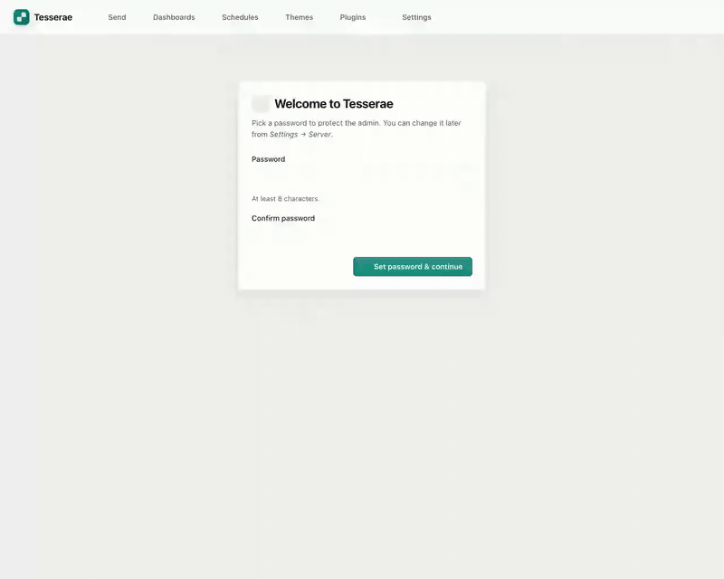
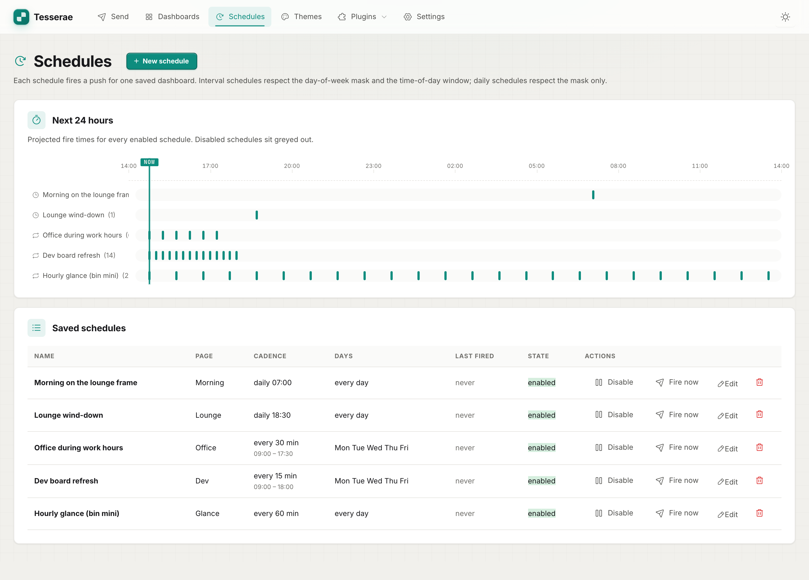
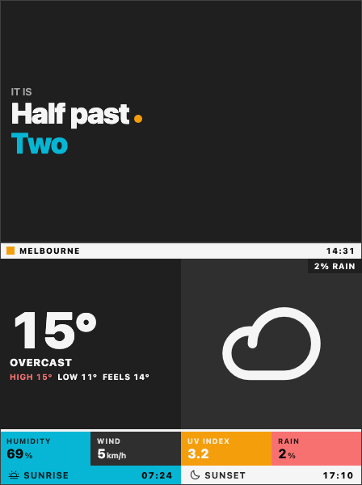

# Tesserae

E-ink dashboard companion. Compose tile-based dashboards in the browser, render
headless, push the resulting frame to one or more devices (Pi client, ESP32
client) over MQTT.

Sibling rebuild of [inky-dash](https://github.com/dmellok/inky-dash). Same job,
but the publishing pipeline is a first-class extension point — new device, new
renderer, new format = drop a folder.

The name: a [*tessera*](https://en.wikipedia.org/wiki/Tessera) is the
individual tile of a mosaic; the editor composes a dashboard out of cells.

**[Full documentation](https://dmellok.github.io/tesserae/)** — install
guides, the [widget gallery](https://dmellok.github.io/tesserae/widgets/gallery/),
hardware compatibility, and how to build a widget (with AI).

## See it in action

Two short screen recordings, both auto-generated from `scripts/record_*.py`
(headed Playwright + a custom in-page cursor — see those scripts for the
mechanism, or to re-record after a UI change).

### First-run onboarding

Set the admin password, point at a broker (built-in or your own), register
the panel with its dimensions, push a starter dashboard, opt in to
anonymous telemetry. ~1 min.



### Building a dashboard

Pick a layout preset, fill cells with widgets, then use the custom-layout
editor to split a cell and drop in a third widget. Live preview updates
as you go. ~1 min.


## Screenshots

Compose in the browser — pick widgets, a theme, and which display(s) each
dashboard binds to — then render headless and push the frame over MQTT.

<details>
<summary><b>Screenshots</b> — admin UI &amp; example device frames (click to expand; click any image for full size)</summary>

<h4>Admin UI</h4>

<table>
  <tr>
    <td align="center" width="50%"><a href="docs/screenshots/ui-dashboards.png"></a><br><sub>Dashboards</sub></td>
    <td align="center" width="50%"><a href="docs/screenshots/ui-editor.png"></a><br><sub>Editor + live preview</sub></td>
  </tr>
  <tr>
    <td align="center"><a href="docs/screenshots/ui-send.png"></a><br><sub>Send</sub></td>
    <td align="center"><a href="docs/screenshots/ui-schedules.png"></a><br><sub>Schedules</sub></td>
  </tr>
  <tr>
    <td align="center"><a href="docs/screenshots/ui-settings.png"></a><br><sub>Device settings</sub></td>
    <td></td>
  </tr>
</table>

<h4>Frames pushed to the panels</h4>
<sub>Each dashboard renders to a panel-sized frame and publishes only to the display(s) it's bound to — across themes and panel sizes (Glance is a small 448×600 panel).</sub>

<table>
  <tr>
    <td align="center"><a href="docs/screenshots/dash-morning.png"></a><br><sub>Morning</sub></td>
    <td align="center"><a href="docs/screenshots/dash-lounge.png"></a><br><sub>Lounge</sub></td>
    <td align="center"><a href="docs/screenshots/dash-office.png"></a><br><sub>Office</sub></td>
    <td align="center"><a href="docs/screenshots/dash-dev.png"></a><br><sub>Dev</sub></td>
    <td align="center"><a href="docs/screenshots/dash-glance.png"></a><br><sub>Glance</sub></td>
  </tr>
</table>

</details>

## Status

A working hobbyist build. The pipeline (composer → renderers →
transport → devices), the scheduler, Home Assistant discovery, the
theme builder, the form-driven page editor, and the modern admin UI are
all in.

**Multi-head is first-class.** Register multiple physical panels as
device instances, each with its own MQTT topics and panel size; bind a
dashboard to a specific display; auto-discover clients that announce
themselves on the broker; and calibrate a panel's orientation from a
numbered test card. See [Setting up a device](#setting-up-a-device).

Tests + ruff + mypy --strict (on contract modules) clean. CI runs
ruff / pytest / mypy on every push (see
[.github/workflows/ci.yml](.github/workflows/ci.yml)).

The widget catalogue now spans weather, F1, calendar, news, finance, GitHub,
clocks, sky, pictures, todo, and Melbourne public transport — **47 widgets**
in `plugins/`, alongside `theme` / `font` / `data` / `admin` plugins. See
[Widget stability tiers](#widget-stability-tiers) below for an upfront read
on which ones depend on undocumented upstreams.

> **For tinkerers, not your mum.** Tesserae is a `git clone → tinker`
> dashboard. The admin chrome is polished but the deployment story still
> assumes you can read tracebacks and edit settings.json. Aimed at
> hobbyists who run a Pi appliance at home.

## Architecture in one diagram

```
┌─────────────────────────────────────────────────────────────────────┐
│  Composition    Plugins  Themes  Fonts                              │
│  (browser)         │       │       │                                │
│                    └───────┼───────┘                                │
│                            ▼                                        │
│                  Panel-sized PNG (composition orientation)          │
├─────────────────────────────────────────────────────────────────────┤
│  Render         Renderers (drop-a-folder)                           │
│                    ├─ pi_png     (orientation: landscape)           │
│                    ├─ pi_bin     (orientation: composition)         │
│                    └─ esp32_bin  (orientation: composition)         │
│                            ▼                                        │
│                  (artifact bytes, payload, mime, topic, retain)     │
├─────────────────────────────────────────────────────────────────────┤
│  Transport      MqttTransport (one job: publish)                    │
│                            ▼                                        │
│                  Broker                                             │
├─────────────────────────────────────────────────────────────────────┤
│  Devices        Device kinds (drop-a-folder) + user instances      │
│                    ├─ pi_bin_client  (tesserae/pi_bin/status)       │
│                    ├─ pi_png_client  (tesserae/pi_png/status)       │
│                    └─ esp32_client   (status + pub/sub config)      │
└─────────────────────────────────────────────────────────────────────┘
```

A **kind** is a built-in device template; each physical panel you
register is an **instance** of a kind with its own id, topics, and panel
size (multi-head). Instances are created in Settings → Devices.

Four layers, one direction of flow. Each layer only knows the boxes directly
adjacent. **One canonical internal orientation: composition** (panel's mounted
orientation). Renderers transform out of it via their declared `orientation`
field — no orientation muddle.

## MQTT topic scheme

Grammar: `tesserae/<device-id>/<channel>[/<format>]`

`<device-id>` is the device's topic prefix. Built-in kinds default to
`pi_bin`, `pi_png`, and `esp32`; user-registered instances use their own
id (e.g. `pi_kitchen`, `esp32_hallway`). The table below shows the
default prefixes.

| Topic | Payload | Retain | Direction |
|---|---|---|---|
| `tesserae/pi_png/frame/png` | `{url, rotate, scale, bg, saturation}` | no | publish |
| `tesserae/pi_bin/frame/bin` | `{url}` | no | publish |
| `tesserae/pi_bin/status`, `tesserae/pi_png/status` | `{state, kind, panel_w, panel_h, fw_version, …}` | yes | subscribe |
| `tesserae/esp32/frame/bin` | `{url}` | yes | publish |
| `tesserae/esp32/status` | `{battery_mv, battery_pct, rssi, ip, kind, panel_w, panel_h, fw_version}` | yes | subscribe |
| `tesserae/esp32/config` | `{sleep_interval_s}` | yes | both |
| `tesserae/+/status` | (wildcard) — any unregistered id is surfaced for one-click registration in Settings → Devices | — | subscribe |

The `kind` / `panel_w` / `panel_h` / `fw_version` keys in a heartbeat are
the discovery hint: a client that includes them gets pre-filled in the
Discovered strip so registering it is one click.

## Clients

The server publishes; something downstream paints the panel. Three reference
clients live in their own repos — pick whichever matches your hardware. Each
takes a `device_id` (the topic prefix; defaults shown below) and announces
itself on `tesserae/<device_id>/status` so the server can auto-discover it.

**[tesserae-pi-png-client](https://github.com/dmellok/tesserae-pi-png-client)**
pairs with the `pi_png` renderer (default id `pi_png`). A Pi-side Python daemon
that subscribes to `tesserae/<device_id>/frame/png` and hands incoming PNGs to
[`inky`](https://github.com/pimoroni/inky)'s high-level `set_image()`, so it
works on every panel the inky lib supports — pHAT, wHAT, Impression 4"/5.7"/
7.3"/13.3", 2/3/6/7 colour. Quantising on the Pi every frame makes it the
slower of the two Pi paths, but it stays wire-compatible with the inky-dash
v3/v4 listener protocol.

**[tesserae-pi-bin-client](https://github.com/dmellok/tesserae-pi-bin-client)**
pairs with the `pi_bin` renderer (default id `pi_bin`). Same Pi-side daemon
shape, but it subscribes to `tesserae/<device_id>/frame/bin` and writes the
server's already-packed 4-bpp buffer
straight into inky's internal `_buf` — no PIL on the Pi paint path. The result
is the fastest path on a Pimoroni Inky Impression (Spectra 6 / Waveshare E6,
any of the four sizes — auto-detected via the HAT EEPROM). The trade is a
private-API dependency: the `inky` version is pinned exactly.

**[tesserae-esp32-bin-client](https://github.com/dmellok/tesserae-esp32-bin-client)**
pairs with the `esp32_bin` renderer (default id `esp32`). Battery-powered
ESP32-S3-WROOM-2 firmware for the Waveshare 13.3" Spectra 6 panel: deep-sleeps
between wakes, subscribes to the retained `tesserae/<device_id>/frame/bin`
topic, and skips the download when the URL hash hasn't changed. Months of
battery life from a single Li-Po; refresh cadence is set by `sleep_interval_s`
on `tesserae/<device_id>/config`. Device id + Wi-Fi are set through a captive
portal (also reachable on the LAN afterward via `tesserae-<id>.local`).

## Install

One-liner for **macOS, Linux, and Raspberry Pi**:

```sh
curl -fsSL https://raw.githubusercontent.com/dmellok/tesserae/main/install.sh | bash
```

**Windows** (PowerShell):

```powershell
iwr https://raw.githubusercontent.com/dmellok/tesserae/main/install.ps1 -UseBasicParsing | iex
```

The installer:

- Sanity-checks `git` + Python 3.11+
- Clones the repo (default: `~/tesserae`, override with `TESSERAE_DIR`)
- Creates a venv and installs the project
- Asks for a port (default 8000)
- Installs Chromium via Playwright for the webpage-rendering features;
  if Playwright doesn't ship a binary for your platform (e.g. 32-bit
  Pi OS), it looks for system `chromium-browser` / Chrome / Edge and
  points Playwright at that. If neither exists it warns and continues
  — everything except webpage rendering still works.
- Writes a `run.sh` (or `run.ps1`) shortcut in the install dir.

After it finishes, start the server with `./run.sh` from the install
dir, then visit `http://localhost:8000/` (or whatever port you chose).
First run sends you to `/setup` to pick an admin password.

Manual install (or if you already cloned the repo):

```sh
python3 -m venv .venv
.venv/bin/pip install -e ".[dev]"
.venv/bin/python -m app.main         # production: waitress, port 8000
.venv/bin/python -m app.main --dev   # Flask dev server with auto-reload + debugger
```

`python -m app.main` runs under [waitress](https://docs.pylonsproject.org/projects/waitress/),
a pure-Python production WSGI server — same command on a Raspberry Pi
appliance, no need for nginx in front for a single-user install. `--dev`
opts into Flask's dev server when you're hacking on the admin and want
auto-reload.

### Chromium for webpage rendering

The Send → Webpage tab and the `webpage` widget shoot screenshots with
headless Chromium via Playwright. Playwright ships its own binaries for
most platforms; on 32-bit Raspberry Pi OS it doesn't, so the installer
falls back to the system browser. To override yourself, point at any
Chromium-compatible binary:

```sh
export TESSERAE_CHROMIUM_PATH=/usr/bin/chromium-browser
```

Or write the path to `data/core/.chromium` (single line) — the renderer
reads either at launch.

Open <http://127.0.0.1:8000/> — on first boot you'll be sent to `/setup`
to pick an admin password. After that, sign in at `/login` and configure
the broker + base URL at `/settings`. Renderers and plugins that declare
settings show up as their own sections, generated from manifests.

To preview a single widget without composing a dashboard, run `--dev`, sign
in, then open <http://127.0.0.1:8000/_test/render?plugin=clock_analog&size=md>
in your browser. `/_test/render` needs the dev/test server **and** a session
— it isn't loopback-exempt. (The loopback bypass is for `/compose/`,
`/renders/`, and `/plugins/<id>/<asset>`, which the in-process renderer
fetches without a session.)

Run the test suite:

```sh
.venv/bin/pytest -q
.venv/bin/ruff check . && .venv/bin/ruff format --check .
.venv/bin/mypy app/
```

The renderer + transport + push pipeline + auth + settings flow are all
covered with no broker or Chromium dependency.

## Setting up a device

Once the server is running and pointed at your MQTT broker
(Settings → Server → MQTT broker):

1. **Flash a client** for your hardware (see [Clients](#clients)). On
   first run it publishes a heartbeat on `tesserae/<device-id>/status`.
2. **Settings → Devices → Discovered.** A client that announced itself
   shows up here with its kind and panel size pre-filled — click
   **Register** to turn it into a device instance. (No heartbeat yet?
   Use **Add device** to create one by hand.)
3. **Calibrate orientation.** Hit **Calibrate** to push a numbered test
   card to the panel, then tell it which number landed in the top-left
   corner; it sets the rotation that makes your dashboard read upright.
   The **Rotation** dropdown (0 / 90 / 180 / 270°) is there for manual
   tweaks.
4. **Bind a dashboard.** In the page editor, set **Target device** so a
   dashboard sizes to that panel and pushes only to its renderers. Leave
   it on *(any)* to fan out to every renderer at the virtual-panel size.

Running more than one panel? Repeat with a distinct `device-id` per
client — each gets its own topics, panel size, and orientation.

## Widget stability tiers

Every widget that hits the network depends on an upstream — and not every
upstream is equally reliable. Tesserae's tiers say what to expect when
your widget suddenly shows an error after a year of working fine.

### Stable

Backed by an official, documented API. Won't break unless the upstream
ships a deliberate breaking change (which usually comes with notice).

| Widget | Upstream |
|---|---|
| `weather_now`, `weather_hourly`, `weather_forecast`, `weather_air_quality`, `weather_pollen_count` (Open-Meteo path) | open-meteo.com |
| `f1_next`, `f1_last_race`, `f1_weekend`, `f1_standings_drivers` | jolpi.ca/ergast (maintained Ergast successor) |
| `news_rss` | any RSS 2.0 / Atom 1.0 feed |
| `news_hacker_news` | hacker-news.firebaseio.com (Firebase-hosted, documented) |
| `news_wikipedia_otd` | Wikimedia REST API |
| `finance_crypto` | CoinGecko v3 (documented) |
| `finance_currency` | frankfurter.app (ECB-sourced, documented) |
| `github_repo`, `github_releases`, `github_activity`, `github_pr_queue`, `github_actions`, `github_contributions` | api.github.com (REST v3 + GraphQL v4) |
| `calendar_month`, `calendar_week`, `calendar_day` | iCal feeds from Google / iCloud / Outlook |
| `clock_sunrise_sunset` | open-meteo.com |
| `sky_aurora` | services.swpc.noaa.gov (NOAA Space Weather, documented) |
| `sky_air_traffic` | opensky-network.org (rate-limited but documented) |
| `public_transport_times` | timetableapi.ptv.vic.gov.au (official PTV API v3) |
| `picture_apod` | api.nasa.gov |
| `picture_unsplash` | api.unsplash.com |

### Best-effort

Undocumented endpoint, but used by enough open-source projects for long
enough that breakage would be a notable event. Failure mode is usually
"widget returns an error payload until somebody updates the parser."

| Widget | Why best-effort |
|---|---|
| `finance_stock` | Yahoo Finance's `/v8/finance/chart/` endpoint isn't officially documented. Has been stable for 7+ years and is what most "free stock API" libraries reach for. |
| `picture_apple_album` | Reverse-engineered iCloud Shared Album endpoints. The shape has held up for ~10 years; Apple has shifted partitioning twice without breaking the protocol. |

### Fragile

Scraping or relying on a soft policy. Most likely to break with no
notice. The widget will surface an error payload rather than silently
serve stale data.

| Widget | Why fragile |
|---|---|
| `weather_pollen_count` (Melbourne fallback) | Scrapes melbournepollen.com.au's home page when Open-Meteo's pollen data is null (it's Europe-only). Any DOM redesign on their end breaks this path. The Open-Meteo path is stable. |
| `news_reddit` | Reads Reddit's per-subreddit RSS feed (`/r/<sub>/<sort>.rss`). The public `.json` API now 403-blocks server-side reads outright, so RSS is the remaining no-auth path — it carries titles/authors/times but **no** score or comment counts, and could itself be locked down. |

### Tier policy

* **Stable widgets** can be relied on for long-running dashboards. PR
  welcome if you spot an upstream that's tightened terms.
* **Best-effort widgets** should not be the only display in a
  twelve-month deployment. If they break, the widget's error payload
  tells you exactly which endpoint failed.
* **Fragile widgets** should be considered convenience. If your dashboard
  cares about pollen counts every day, treat the widget as a starting
  point and contribute a more durable backend.

## Tech stack

- Python 3.11+, Flask 3.x, Pydantic 2.x
- Pillow + numpy for image ops
- Playwright + Chromium for headless render
- paho-mqtt for the broker bridge
- Lit 3.x web components (no React), vanilla JS (no TypeScript)
- esbuild bundles one entry per admin page (`static/pages/*.js` → `static/dist/`)

## Repo layout

```
tesserae/
  app/             Flask app, transport, push pipeline, state, scheduler
  plugins/<id>/    widget / theme / font / data / admin plugins
                   (drop-a-folder) — 47 widgets ship bundled
  renderers/<id>/  renderer plugins (drop-a-folder)
  devices/<id>/    device plugins (drop-a-folder)
  schema/          JSON Schemas for plugin/renderer/device manifests
  static/          Lit components, page entries, shared CSS, dist/, icons/
                   (vendored Phosphor 2.1.1 — regular/fill/bold/duotone/light/thin, woff2 only, 1.5 MB)
  templates/       Jinja shells
  tests/           top-level tests
  data/            runtime state (gitignored)
```

## Privacy & telemetry

**Off by default.** Tesserae ships with no usage telemetry enabled. A
fresh clone or install never phones home.

When you opt in (Settings → Server → App), Tesserae posts at most **two
anonymous events** to the project's analytics backend (running the open-
source [aptabase/aptabase][aptabase]) so the maintainer can see how many
people are running Tesserae and what versions they're on:

- `app.started` — once per process start. Carries the Tesserae version,
  Python version, and platform name.
- `update.applied` — when the in-app updater applies a new revision.
  Carries the from/to short SHAs, the channel (edge/stable), and whether
  deps were reinstalled.

The only stable identifier is a random UUID generated on first run and
written to `data/core/.instance_id`. Tesserae never sends IP addresses,
hostnames, paths, settings, secrets, push contents, dashboard layouts,
broker addresses, or anything tied to a real-world identity.

The endpoint is hard-coded in [`app/telemetry.py`](app/telemetry.py)
(it's the maintainer's analytics deployment, not user-configurable) so
that opted-in counts add up to a real total instead of being scattered
across whoever set up their own backend. You control whether to send;
you don't control where it goes.

**Disable any time:**

- Untick *Send anonymous usage telemetry* in Settings → Server → App, or
- Set `TESSERAE_TELEMETRY=0` (kill switch — wins over stored settings).

[aptabase]: https://github.com/aptabase/aptabase

## License

MIT — see [LICENSE](LICENSE).
