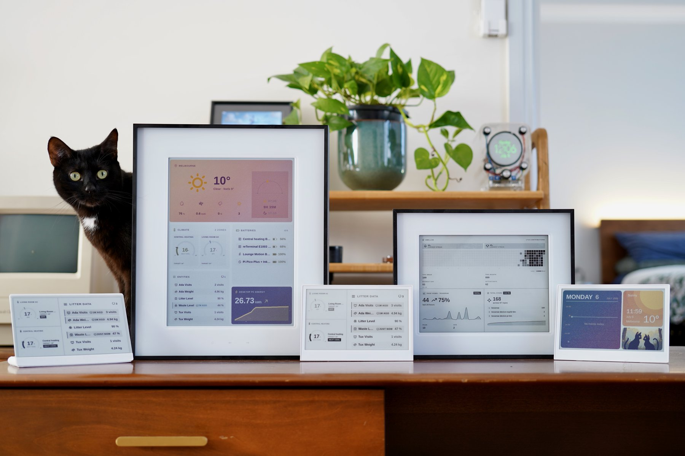

# Tesserae

[![License](https://img.shields.io/badge/license-AGPL--3.0-blue?style=for-the-badge&logo=data:image/svg+xml;base64,PHN2ZyB4bWxucz0iaHR0cDovL3d3dy53My5vcmcvMjAwMC9zdmciIHZpZXdCb3g9IjAgMCAyNTYgMjU2Ij48cmVjdCB3aWR0aD0iMjU2IiBoZWlnaHQ9IjI1NiIgZmlsbD0ibm9uZSIvPjxsaW5lIHgxPSIxMjgiIHkxPSI0MCIgeDI9IjEyOCIgeTI9IjIxNiIgZmlsbD0ibm9uZSIgc3Ryb2tlPSJjdXJyZW50Q29sb3IiIHN0cm9rZS1saW5lY2FwPSJyb3VuZCIgc3Ryb2tlLWxpbmVqb2luPSJyb3VuZCIgc3Ryb2tlLXdpZHRoPSIxNiIvPjxsaW5lIHgxPSIxMDQiIHkxPSIyMTYiIHgyPSIxNTIiIHkyPSIyMTYiIGZpbGw9Im5vbmUiIHN0cm9rZT0iY3VycmVudENvbG9yIiBzdHJva2UtbGluZWNhcD0icm91bmQiIHN0cm9rZS1saW5lam9pbj0icm91bmQiIHN0cm9rZS13aWR0aD0iMTYiLz48bGluZSB4MT0iNTYiIHkxPSI4OCIgeDI9IjIwMCIgeTI9IjU2IiBmaWxsPSJub25lIiBzdHJva2U9ImN1cnJlbnRDb2xvciIgc3Ryb2tlLWxpbmVjYXA9InJvdW5kIiBzdHJva2UtbGluZWpvaW49InJvdW5kIiBzdHJva2Utd2lkdGg9IjE2Ii8+PHBhdGggZD0iTTI0LDE2OGMwLDE3LjY3LDIwLDI0LDMyLDI0czMyLTYuMzMsMzItMjRMNTYsODhaIiBmaWxsPSJub25lIiBzdHJva2U9ImN1cnJlbnRDb2xvciIgc3Ryb2tlLWxpbmVjYXA9InJvdW5kIiBzdHJva2UtbGluZWpvaW49InJvdW5kIiBzdHJva2Utd2lkdGg9IjE2Ii8+PHBhdGggZD0iTTE2OCwxMzZjMCwxNy42NywyMCwyNCwzMiwyNHMzMi02LjMzLDMyLTI0TDIwMCw1NloiIGZpbGw9Im5vbmUiIHN0cm9rZT0iY3VycmVudENvbG9yIiBzdHJva2UtbGluZWNhcD0icm91bmQiIHN0cm9rZS1saW5lam9pbj0icm91bmQiIHN0cm9rZS13aWR0aD0iMTYiLz48L3N2Zz4=&logoColor=white)](LICENSE)
[](https://github.com/dmellok/tesserae/releases/latest)
[](https://github.com/dmellok/tesserae/actions/workflows/ci.yml)
[](https://github.com/dmellok/tesserae/discussions)
[![Codespaces](https://img.shields.io/badge/codespaces-launch-24292e?style=for-the-badge&logo=data:image/svg+xml;base64,PHN2ZyB4bWxucz0iaHR0cDovL3d3dy53My5vcmcvMjAwMC9zdmciIHZpZXdCb3g9IjAgMCAyNTYgMjU2Ij48cmVjdCB3aWR0aD0iMjU2IiBoZWlnaHQ9IjI1NiIgZmlsbD0ibm9uZSIvPjxwYXRoIGQ9Ik0xMTIsMjA4SDcyQTU2LDU2LDAsMSwxLDg1LjkyLDk3Ljc0IiBmaWxsPSJub25lIiBzdHJva2U9ImN1cnJlbnRDb2xvciIgc3Ryb2tlLWxpbmVjYXA9InJvdW5kIiBzdHJva2UtbGluZWpvaW49InJvdW5kIiBzdHJva2Utd2lkdGg9IjE2Ii8+PHBvbHlsaW5lIHBvaW50cz0iMTIwIDE2MCAxNTIgMTI4IDE4NCAxNjAiIGZpbGw9Im5vbmUiIHN0cm9rZT0iY3VycmVudENvbG9yIiBzdHJva2UtbGluZWNhcD0icm91bmQiIHN0cm9rZS1saW5lam9pbj0icm91bmQiIHN0cm9rZS13aWR0aD0iMTYiLz48bGluZSB4MT0iMTUyIiB5MT0iMjA4IiB4Mj0iMTUyIiB5Mj0iMTI4IiBmaWxsPSJub25lIiBzdHJva2U9ImN1cnJlbnRDb2xvciIgc3Ryb2tlLWxpbmVjYXA9InJvdW5kIiBzdHJva2UtbGluZWpvaW49InJvdW5kIiBzdHJva2Utd2lkdGg9IjE2Ii8+PHBhdGggZD0iTTgwLDEyOGE4MCw4MCwwLDEsMSwxMTIsNzMuMzQiIGZpbGw9Im5vbmUiIHN0cm9rZT0iY3VycmVudENvbG9yIiBzdHJva2UtbGluZWNhcD0icm91bmQiIHN0cm9rZS1saW5lam9pbj0icm91bmQiIHN0cm9rZS13aWR0aD0iMTYiLz48L3N2Zz4=&logoColor=white)](https://codespaces.new/dmellok/tesserae?quickstart=1)
[](https://github.com/sponsors/dmellok)

<p align="center">
  <a href="docs/screenshots/hero-rack.jpg">
    
  </a>
  <br>
  <em>Nine panels, one Tesserae server.</em>
</p>

Self-hosted dashboard companion for e-ink displays. Compose tile-based
dashboards in a browser, render the frame headless, push it to one or
more panels over MQTT or HTTP.

Open source under AGPL-3.0-or-later. No SaaS, no cloud account. The only
outbound contact is `api.tesserae.ink` for update checks, an anonymous
install count, and a daily aggregate heartbeat, off by default and opt-in
(you're asked once at first-run setup; toggle in Settings → System → Online
features).

**📖 [Full documentation](https://docs.tesserae.ink/):**
install guides, [hardware quickstarts](https://docs.tesserae.ink/quickstart/),
[widget gallery](https://docs.tesserae.ink/widgets/gallery/),
[community catalog](https://docs.tesserae.ink/widgets/community/),
[architecture deep dive](https://docs.tesserae.ink/dev/architecture/),
[how to build a widget](https://docs.tesserae.ink/dev/writing-a-widget/),
[how to add hardware support](https://docs.tesserae.ink/dev/adding-hardware/).

## Quick start

```sh
mkdir tesserae && cd tesserae
curl -fsSLO https://raw.githubusercontent.com/dmellok/tesserae/main/docker-compose.yml
docker compose up -d
```

Open <http://localhost:8765>. First request walks through password setup
and the onboarding wizard.

Other install paths:
[Home Assistant App](https://docs.tesserae.ink/install/home-assistant/),
[LXC / Proxmox / MicroCloud](https://docs.tesserae.ink/install/lxc/),
[macOS / Linux / Pi shell installer](https://docs.tesserae.ink/install/server/),
[Windows PowerShell](https://docs.tesserae.ink/install/server/),
[manual venv](https://docs.tesserae.ink/install/server/#manual-install).

Server is running? Pick a [hardware quickstart](https://docs.tesserae.ink/quickstart/) to get a panel on the wall.

## How it works

Dashboards are plain HTML. The editor preview and the production render
load the **same URL**: a headless Chromium (Playwright) screenshots the
composition at panel resolution, so "looked fine in the editor, broke on
the panel" is impossible by construction.

The frame then goes through a per-device renderer: Floyd-Steinberg
dithering against the panel's **measured** color palette (Spectra 6 and
ACeP panels don't actually produce sRGB primaries; calibrated
measurements come from [epdoptimize](https://github.com/paperlesspaper/epdoptimize)),
then packing into the exact byte format the panel wants: packed 4-bit
Spectra 6, 1-bit mono, or 4-bit grayscale.

Devices are deliberately **thin clients** with no on-device image
decoding. Always-on clients (a Pi driving an Inky) get frames pushed
over MQTT the moment a page changes. Battery clients (ESP32) wake, `GET`
their frame over REST with `If-None-Match` (a 304 skips both the
download and the slow e-ink refresh), `POST` battery + RSSI telemetry,
and deep-sleep on a server-driven interval. Wall-clock time comes from
the HTTP `Date` header, so there's no SNTP on-device.

```
browser editor          Tesserae server                    panels
┌──────────┐   HTTP   ┌──────────────────────┐   MQTT   ┌─────────────┐
│ composer │─────────▶│ headless render      │─────────▶│ Pi + Inky   │
│ /compose │          │ dither (measured     │          ├─────────────┤
└──────────┘          │   palettes)          │   REST   │ ESP32,      │
                      │ pack panel-native    │◀────────▶│ Kindle,     │
                      │ schedule / rotate    │          │ TRMNL       │
                      └──────────────────────┘          └─────────────┘
```

Every layer is a drop-a-folder plugin: widgets, themes, renderers,
transports, and device kinds. The seams are real directories:
[`plugins/`](plugins/) · [`renderers/`](renderers/) ·
[`transports/`](transports/) · [`devices/`](devices/).

## Design decisions

**Server-side rendering, dumb firmware.** The server pre-renders each
frame into the exact bytes the panel controller wants; the
[device firmware](https://github.com/dmellok/tesserae-device-firmware)
streams them straight to the panel. Adding a new panel is a board header
plus one driver. The network, power, and provisioning stack never
changes.

**Widgets are sandboxed.** Third-party widgets declare the network hosts
they need in a `requires:` block in `plugin.json`, and the host enforces
the allowlist at the socket layer. An undeclared connection raises
`CapabilityDenied` instead of phoning home. The
[threat model](https://docs.tesserae.ink/dev/publishing-a-widget/) is
documented honestly, including what it doesn't catch.

**One server, a fleet of panels.** Tesserae splits rendering from
transport from hardware, so a single instance drives every panel in the
house, each with its own dashboards, schedules, and rotations.

**Community widgets install from an audited catalog.** Pinned release
tarballs, sha256-verified, schema-validated, PR-reviewed:
[tesserae-widgets](https://github.com/dmellok/tesserae-widgets).

## Supported hardware

Tesserae renders to one of several panel families through drop-a-folder
device plugins. The list below is the verified set; anything marked TBD
is awaiting a real-hardware confirmation.

### Seeed Studio

The reTerminal E-Series and XIAO ePaper family run the [Tesserae-native firmware](https://github.com/dmellok/tesserae-device-firmware); flash from the browser in one click at [tesserae.ink/flash](https://tesserae.ink/flash) (Chrome / Edge, Web Serial, no toolchain). Battery-powered, no assembly required.



| Model | Panel | Client | Status |
|---|---|---|---|
| [reTerminal E1001](https://www.seeedstudio.com/reTerminal-E1001-p-6534.html) | 7.5" mono, 800×480 | [tesserae-device-firmware](https://github.com/dmellok/tesserae-device-firmware) | ✅ |
| [reTerminal E1002](https://www.seeedstudio.com/reTerminal-E1002-p-6533.html) | 7.3" Spectra 6, 800×480 | [tesserae-device-firmware](https://github.com/dmellok/tesserae-device-firmware) | ✅ |
| [reTerminal E1003](https://www.seeedstudio.com/reTerminal-E1003-p-6731.html) | 10.3" mono, 16-level grey, 1872×1404 | [tesserae-device-firmware](https://github.com/dmellok/tesserae-device-firmware) | ✅ |
| [reTerminal E1004](https://www.seeedstudio.com/reTerminal-E1004-p-6692.html) | 13.3" Spectra 6, 1200×1600 | [tesserae-device-firmware](https://github.com/dmellok/tesserae-device-firmware) | ✅ |
| [XIAO ePaper EE02](https://www.seeedstudio.com/XIAO-ePaper-DIY-Kit-EE02-for-13-3-Spectratm-6-E-Ink.html) | 13.3" Spectra 6, 1200×1600 | [tesserae-device-firmware](https://github.com/dmellok/tesserae-device-firmware) | ✅ |
| [XIAO 7.5" ePaper Panel](https://www.seeedstudio.com/XIAO-7-5-ePaper-Panel-p-6416.html) | 7.5" mono, 800×480 | [tesserae-device-firmware](https://github.com/dmellok/tesserae-device-firmware) | ✅ |
| [TRMNL 7.5" OG DIY Kit](https://www.seeedstudio.com/TRMNL-7-5-Inch-OG-DIY-Kit-p-6481.html) | 7.5" mono, 800×480 | TRMNL firmware | ✅ via BYOS |

### Pimoroni Inky

| Panel | Resolution | Client | Status |
|---|---|---|---|
| [Inky Impression 4"](https://shop.pimoroni.com/products/inky-impression) (6-colour Spectra 6) | 640×400 | [pi-png](https://github.com/dmellok/tesserae-device-pi-png) or [pi-bin](https://github.com/dmellok/tesserae-device-pi-bin) | TBD |
| [Inky Impression 5.7"](https://shop.pimoroni.com/products/inky-impression-5-7) (7-colour ACeP) | 600×448 | [pi-png](https://github.com/dmellok/tesserae-device-pi-png) or [pi-bin](https://github.com/dmellok/tesserae-device-pi-bin) | ✅ |
| [Inky Impression 7.3"](https://shop.pimoroni.com/products/inky-impression?variant=55186435244411) (6-colour Spectra 6) | 800×480 | [pi-png](https://github.com/dmellok/tesserae-device-pi-png) or [pi-bin](https://github.com/dmellok/tesserae-device-pi-bin) | ✅ |
| [Inky Impression 13.3"](https://shop.pimoroni.com/products/inky-impression?variant=55186435277179) (6-colour Spectra 6) | 1600×1200 | [pi-png](https://github.com/dmellok/tesserae-device-pi-png) or [pi-bin](https://github.com/dmellok/tesserae-device-pi-bin) | ✅ |
| Inky [pHAT](https://shop.pimoroni.com/products/inky-phat) / [wHAT](https://shop.pimoroni.com/products/inky-what) | various | [pi-png](https://github.com/dmellok/tesserae-device-pi-png) | works via `pi_png` |

### Waveshare

| Panel | Resolution | Client | Status |
|---|---|---|---|
| [Waveshare 13.3" Spectra 6 (ESP32-S3)](https://www.waveshare.com/esp32-s3-epaper-13.3e6.htm) | 1200×1600 | [esp32-bin](https://github.com/dmellok/tesserae-device-esp32-bin) | ✅ |
| [Waveshare 7.3" PhotoPainter (ESP32-S3)](https://www.waveshare.com/esp32-s3-photopainter.htm) | 800×480 | [photopainter-7.3-bin](https://github.com/dmellok/tesserae-device-photopainter-7.3-bin) | ✅ |
| [Waveshare 4.2" B/W (ESP32)](https://www.waveshare.com/4.2inch-e-paper-module.htm) | 400×300 | [esp32-bw](https://github.com/dmellok/tesserae-device-esp32-bw) | TBD |

### TRMNL-compatible (HTTP pull)

Any client implementing the [TRMNL BYOS spec](https://help.trmnl.com/en/articles/9510536-bring-your-own-server)
works against the `trmnl_png` renderer.

| Panel | Resolution | Client | Status |
|---|---|---|---|
| [TRMNL OG](https://shop.trmnl.com/products/trmnl) | 800×480 | TRMNL firmware | ✅ via BYOS |
| [TRMNL X](https://shop.trmnl.com/products/trmnl-x) | 1872×1404 (10.3") | TRMNL firmware | TBD |
| Amazon Kindle Paperwhite 2 (jailbroken) | 758×1024 | [KOReader trmnl-display plugin](https://github.com/koreader/koreader) | ✅ |

### Custom panels

Anything else: pick `custom` in **Settings → Panel** and set the
dimensions. If a client drives your panel, Tesserae can push frames
to it. A generic CircuitPython client (400+ boards) is in development;
follow [discussion #24](https://github.com/dmellok/tesserae/discussions/24).

Per-client setup walkthroughs (the firmware repos in the Client column):
[Install a client](https://docs.tesserae.ink/install/clients/).
Full renderer / device-kind compatibility matrix:
[Screens & compatibility](https://docs.tesserae.ink/compatibility/).

## Status

Pre-1.0 and moving fast. Every release is documented in the
[CHANGELOG](CHANGELOG.md). CI runs pytest (1,200+ tests), ruff, and
mypy --strict on every push.

Built with AI assistance (Claude Code). Architecture decisions, code
review, hardware testing, and what ships vs. what doesn't are mine.
The changelogs document the debugging in the open.

## Privacy

Tesserae contacts one first-party endpoint, `api.tesserae.ink`, for
update checks, an anonymous marketplace install count, and a daily
aggregate heartbeat (version, platform, deployment kind, device kinds; no
exact counts). No accounts, no personal data, no IP addresses stored, no
third-party analytics. It is **off by default** and opt-in: a fresh install asks once
at first-run setup, and it's a single switch at **Settings → System →
Online features**. Per-device diagnostics (battery, RSSI, sleep cadence)
stay on the box. [Privacy](https://docs.tesserae.ink/privacy/).

## Community

- **[Discussions](https://github.com/dmellok/tesserae/discussions)** for show-your-dashboard, widget pitches, and install help.
- **[Contributing guide](.github/CONTRIBUTING.md)** for dev setup, the three checks (pytest / ruff / mypy), and commit conventions. [Good first issues](https://github.com/dmellok/tesserae/labels/good%20first%20issue).
- **[Hardware reports](https://github.com/dmellok/tesserae/issues/new?template=hardware_compat.yml)**: running an unlisted panel? A compat report is a real contribution.
- **[Security policy](.github/SECURITY.md)** · **[Code of conduct](.github/CODE_OF_CONDUCT.md)**

## Why AGPL

The server stays free even when someone runs it as a service:
improvements have to stay public. And a dashboard for your home
shouldn't report home. No analytics, no accounts, nothing phones out.
Don't take the README's word for it; read the source.

## Credits

Tesserae stands on generously-licensed open source: Phosphor Icons,
Chart.js, 20 typefaces under SIL OFL / Apache 2.0, the TRMNL BYOS
protocol, the KOReader trmnl-display plugin, and
[paperlesspaper/epdoptimize](https://github.com/paperlesspaper/epdoptimize)'s
Spectra 6 + ACeP calibrated palette measurements (also shipped as
selectable presets in the Calibration tab under Apache 2.0). Full
attribution:
[Credits](https://docs.tesserae.ink/credits/),
[NOTICES.md](NOTICES.md).

## License

AGPL-3.0-or-later, see [LICENSE](LICENSE).
