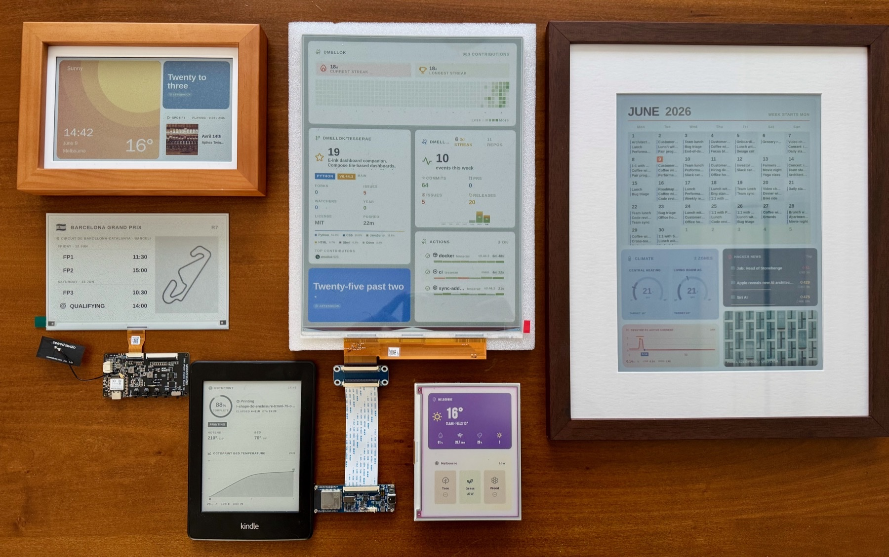

# Tesserae

[![License](https://img.shields.io/badge/license-AGPL--3.0-blue?style=for-the-badge&logo=data:image/svg+xml;base64,PHN2ZyB4bWxucz0iaHR0cDovL3d3dy53My5vcmcvMjAwMC9zdmciIHZpZXdCb3g9IjAgMCAyNTYgMjU2Ij48cmVjdCB3aWR0aD0iMjU2IiBoZWlnaHQ9IjI1NiIgZmlsbD0ibm9uZSIvPjxsaW5lIHgxPSIxMjgiIHkxPSI0MCIgeDI9IjEyOCIgeTI9IjIxNiIgZmlsbD0ibm9uZSIgc3Ryb2tlPSJjdXJyZW50Q29sb3IiIHN0cm9rZS1saW5lY2FwPSJyb3VuZCIgc3Ryb2tlLWxpbmVqb2luPSJyb3VuZCIgc3Ryb2tlLXdpZHRoPSIxNiIvPjxsaW5lIHgxPSIxMDQiIHkxPSIyMTYiIHgyPSIxNTIiIHkyPSIyMTYiIGZpbGw9Im5vbmUiIHN0cm9rZT0iY3VycmVudENvbG9yIiBzdHJva2UtbGluZWNhcD0icm91bmQiIHN0cm9rZS1saW5lam9pbj0icm91bmQiIHN0cm9rZS13aWR0aD0iMTYiLz48bGluZSB4MT0iNTYiIHkxPSI4OCIgeDI9IjIwMCIgeTI9IjU2IiBmaWxsPSJub25lIiBzdHJva2U9ImN1cnJlbnRDb2xvciIgc3Ryb2tlLWxpbmVjYXA9InJvdW5kIiBzdHJva2UtbGluZWpvaW49InJvdW5kIiBzdHJva2Utd2lkdGg9IjE2Ii8+PHBhdGggZD0iTTI0LDE2OGMwLDE3LjY3LDIwLDI0LDMyLDI0czMyLTYuMzMsMzItMjRMNTYsODhaIiBmaWxsPSJub25lIiBzdHJva2U9ImN1cnJlbnRDb2xvciIgc3Ryb2tlLWxpbmVjYXA9InJvdW5kIiBzdHJva2UtbGluZWpvaW49InJvdW5kIiBzdHJva2Utd2lkdGg9IjE2Ii8+PHBhdGggZD0iTTE2OCwxMzZjMCwxNy42NywyMCwyNCwzMiwyNHMzMi02LjMzLDMyLTI0TDIwMCw1NloiIGZpbGw9Im5vbmUiIHN0cm9rZT0iY3VycmVudENvbG9yIiBzdHJva2UtbGluZWNhcD0icm91bmQiIHN0cm9rZS1saW5lam9pbj0icm91bmQiIHN0cm9rZS13aWR0aD0iMTYiLz48L3N2Zz4=&logoColor=white)](LICENSE)
[](https://github.com/dmellok/tesserae/releases/latest)
[](https://github.com/dmellok/tesserae/actions/workflows/ci.yml)
[](https://github.com/dmellok/tesserae/discussions)
[![Codespaces](https://img.shields.io/badge/codespaces-launch-24292e?style=for-the-badge&logo=data:image/svg+xml;base64,PHN2ZyB4bWxucz0iaHR0cDovL3d3dy53My5vcmcvMjAwMC9zdmciIHZpZXdCb3g9IjAgMCAyNTYgMjU2Ij48cmVjdCB3aWR0aD0iMjU2IiBoZWlnaHQ9IjI1NiIgZmlsbD0ibm9uZSIvPjxwYXRoIGQ9Ik0xMTIsMjA4SDcyQTU2LDU2LDAsMSwxLDg1LjkyLDk3Ljc0IiBmaWxsPSJub25lIiBzdHJva2U9ImN1cnJlbnRDb2xvciIgc3Ryb2tlLWxpbmVjYXA9InJvdW5kIiBzdHJva2UtbGluZWpvaW49InJvdW5kIiBzdHJva2Utd2lkdGg9IjE2Ii8+PHBvbHlsaW5lIHBvaW50cz0iMTIwIDE2MCAxNTIgMTI4IDE4NCAxNjAiIGZpbGw9Im5vbmUiIHN0cm9rZT0iY3VycmVudENvbG9yIiBzdHJva2UtbGluZWNhcD0icm91bmQiIHN0cm9rZS1saW5lam9pbj0icm91bmQiIHN0cm9rZS13aWR0aD0iMTYiLz48bGluZSB4MT0iMTUyIiB5MT0iMjA4IiB4Mj0iMTUyIiB5Mj0iMTI4IiBmaWxsPSJub25lIiBzdHJva2U9ImN1cnJlbnRDb2xvciIgc3Ryb2tlLWxpbmVjYXA9InJvdW5kIiBzdHJva2UtbGluZWpvaW49InJvdW5kIiBzdHJva2Utd2lkdGg9IjE2Ii8+PHBhdGggZD0iTTgwLDEyOGE4MCw4MCwwLDEsMSwxMTIsNzMuMzQiIGZpbGw9Im5vbmUiIHN0cm9rZT0iY3VycmVudENvbG9yIiBzdHJva2UtbGluZWNhcD0icm91bmQiIHN0cm9rZS1saW5lam9pbj0icm91bmQiIHN0cm9rZS13aWR0aD0iMTYiLz48L3N2Zz4=&logoColor=white)](https://codespaces.new/dmellok/tesserae?quickstart=1)
[](https://github.com/sponsors/dmellok)

<p align="center">
  <a href="docs/screenshots/hero-rack.jpg">
    
  </a>
  <br>
  <em>Six panels, one Tesserae server.</em>
</p>

Self-hosted dashboard companion for e-ink displays. Compose tile-based
dashboards in a browser, render the frame headless, push it to one or
more panels over MQTT or HTTP.

Open source under AGPL-3.0-or-later. No SaaS, no telemetry, no cloud
account required.

**📖 [Full documentation](https://dmellok.github.io/tesserae/):**
install guides, [hardware quickstarts](https://dmellok.github.io/tesserae/quickstart/),
[widget gallery](https://dmellok.github.io/tesserae/widgets/gallery/),
[community catalog](https://dmellok.github.io/tesserae/widgets/community/),
[architecture deep dive](https://dmellok.github.io/tesserae/dev/architecture/),
[how to build a widget](https://dmellok.github.io/tesserae/dev/writing-a-widget/),
[how to add hardware support](https://dmellok.github.io/tesserae/dev/adding-hardware/).

## Quick start

```sh
mkdir tesserae && cd tesserae
curl -fsSLO https://raw.githubusercontent.com/dmellok/tesserae/main/docker-compose.yml
docker compose up -d
```

Open <http://localhost:8765>. First request walks through password setup
and the onboarding wizard.

Other install paths:
[Home Assistant App](https://dmellok.github.io/tesserae/install/home-assistant/),
[LXC / Proxmox / MicroCloud](https://dmellok.github.io/tesserae/install/lxc/),
[macOS / Linux / Pi shell installer](https://dmellok.github.io/tesserae/install/server/),
[Windows PowerShell](https://dmellok.github.io/tesserae/install/server/),
[manual venv](https://dmellok.github.io/tesserae/install/server/#manual-install).

Server is running? Pick a [hardware quickstart](https://dmellok.github.io/tesserae/quickstart/) to get a panel on the wall.

## Supported hardware

Tesserae renders to one of several panel families through drop-a-folder
device plugins. The list below is the verified set; anything marked TBD
is awaiting a real-hardware confirmation.

### Seeed Studio (TRMNL BYOS)

| Model | Panel | Client | Status |
|---|---|---|---|
| [reTerminal E1001](https://www.seeedstudio.com/reTerminal-E1001-p-6534.html) | 7.5" mono | TRMNL firmware (flash required) | TBD |
| [reTerminal E1002](https://www.seeedstudio.com/reTerminal-E1002-p-6533.html) | 7.3" colour (ACeP) | TRMNL firmware (flash required) | TBD |
| [reTerminal E1003](https://www.seeedstudio.com/reTerminal-E1003-p-6731.html) | 10.3" mono, 16-level grey, 1404×1872 | TRMNL firmware (flash required) | ✅ |
| [reTerminal E1004](https://www.seeedstudio.com/reTerminal-E1004-p-6692.html) | 13.3" colour (Spectra 6), 1200×1600 | TBD | TBD |
| [TRMNL 7.5" OG DIY Kit](https://www.seeedstudio.com/TRMNL-7-5-Inch-OG-DIY-Kit-p-6481.html) | 7.5" mono, 800×480 | TRMNL firmware | ✅ via BYOS |
| [XIAO 7.5" ePaper Panel](https://www.seeedstudio.com/XIAO-7-5-ePaper-Panel-p-6416.html) | 7.5" mono, 800×480 | TRMNL firmware (flash required) | TBD |

### Pimoroni Inky

| Panel | Resolution | Client | Status |
|---|---|---|---|
| [Inky Impression 4"](https://shop.pimoroni.com/products/inky-impression) (6-colour Spectra 6) | 640×400 | [pi-png](https://github.com/dmellok/tesserae-device-pi-png) or [pi-bin](https://github.com/dmellok/tesserae-device-pi-bin) | TBD |
| [Inky Impression 5.7"](https://shop.pimoroni.com/products/inky-impression-5-7) (7-colour ACeP) | 600×448 | [pi-png](https://github.com/dmellok/tesserae-device-pi-png) or [pi-bin](https://github.com/dmellok/tesserae-device-pi-bin) | ✅ |
| [Inky Impression 7.3"](https://shop.pimoroni.com/products/inky-impression?variant=55186435244411) (6-colour Spectra 6) | 800×480 | [pi-png](https://github.com/dmellok/tesserae-device-pi-png) or [pi-bin](https://github.com/dmellok/tesserae-device-pi-bin) | ✅ |
| [Inky Impression 13.3"](https://shop.pimoroni.com/products/inky-impression?variant=55186435277179) (6-colour Spectra 6) | 1600×1200 | [pi-png](https://github.com/dmellok/tesserae-device-pi-png) or [pi-bin](https://github.com/dmellok/tesserae-device-pi-bin) | ✅ |
| Inky [pHAT](https://shop.pimoroni.com/products/inky-phat) / [wHAT](https://shop.pimoroni.com/products/inky-what) | various | [pi-png](https://github.com/dmellok/tesserae-device-pi-png) | works via `pi_png` |

### Waveshare

| Panel | Resolution | Client | Status |
|---|---|---|---|
| [Waveshare 13.3" Spectra 6 (ESP32-S3)](https://www.waveshare.com/esp32-s3-epaper-13.3e6.htm) | 1200×1600 | [esp32-bin](https://github.com/dmellok/tesserae-device-esp32-bin) | ✅ |
| [Waveshare 7.3" PhotoPainter (ESP32-S3)](https://www.waveshare.com/esp32-s3-photopainter.htm) | 800×480 | [photopainter-7.3-bin](https://github.com/dmellok/tesserae-device-photopainter-7.3-bin) | ✅ |
| [Waveshare 4.2" B/W (ESP32)](https://www.waveshare.com/4.2inch-e-paper-module.htm) | 400×300 | [esp32-bw](https://github.com/dmellok/tesserae-device-esp32-bw) | TBD |

### TRMNL-compatible (HTTP pull)

Any client implementing the [TRMNL BYOS spec](https://help.trmnl.com/en/articles/9510536-bring-your-own-server)
works against the `trmnl_png` renderer.

| Panel | Resolution | Client | Status |
|---|---|---|---|
| [TRMNL OG](https://shop.trmnl.com/products/trmnl) | 800×480 | TRMNL firmware | ✅ via BYOS |
| [TRMNL X](https://shop.trmnl.com/products/trmnl-x) | 1872×1404 (10.3") | TRMNL firmware | TBD |
| Amazon Kindle Paperwhite 2 (jailbroken) | 758×1024 | [KOReader trmnl-display plugin](https://github.com/koreader/koreader) | ✅ |

### Custom panels

Anything else: pick `custom` in **Settings → Panel** and set the
dimensions. If a client drives your panel, Tesserae can push frames
to it.

Per-client setup walkthroughs (the firmware repos in the Client column):
[Install a client](https://dmellok.github.io/tesserae/install/clients/).
Full renderer / device-kind compatibility matrix:
[Screens & compatibility](https://dmellok.github.io/tesserae/compatibility/).

## Privacy

Tesserae sends no phone-home telemetry. No install identifier, no
usage events, no third-party analytics. Per-device diagnostics
(battery, RSSI, sleep cadence) stay on the box.
[Privacy](https://dmellok.github.io/tesserae/privacy/).

## Community

- **[Discussions](https://github.com/dmellok/tesserae/discussions)** for show-your-dashboard, widget pitches, install help, and feedback on what's next.
- **[Contributing guide](.github/CONTRIBUTING.md)** for dev setup, the three checks (pytest / ruff / mypy), and commit conventions.
- **[Security policy](.github/SECURITY.md)** for how to report a vulnerability privately.
- **[Code of conduct](.github/CODE_OF_CONDUCT.md)**.

## Credits

Tesserae stands on generously-licensed open source: Phosphor Icons,
Chart.js, 20 typefaces under SIL OFL / Apache 2.0, the TRMNL BYOS
protocol, the KOReader trmnl-display plugin, and
[paperlesspaper/epdoptimize](https://github.com/paperlesspaper/epdoptimize)'s
Spectra 6 + ACeP calibrated palette measurements. Full attribution:
[Credits](https://dmellok.github.io/tesserae/credits/),
[NOTICES.md](NOTICES.md).

## License

AGPL-3.0-or-later, see [LICENSE](LICENSE).
