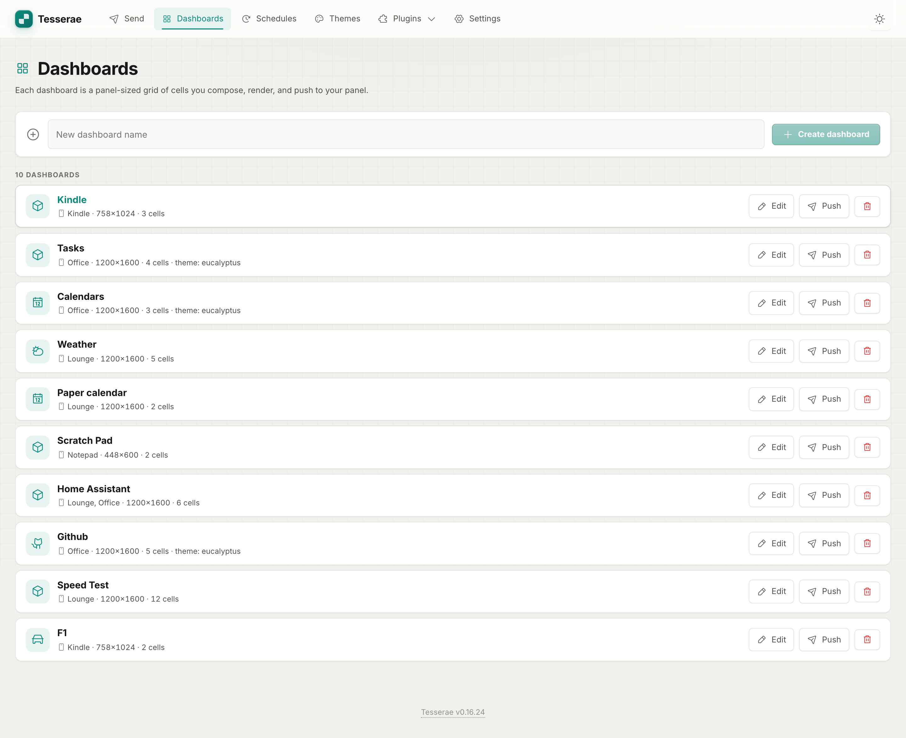
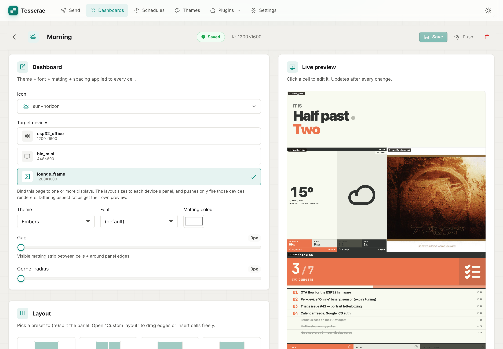
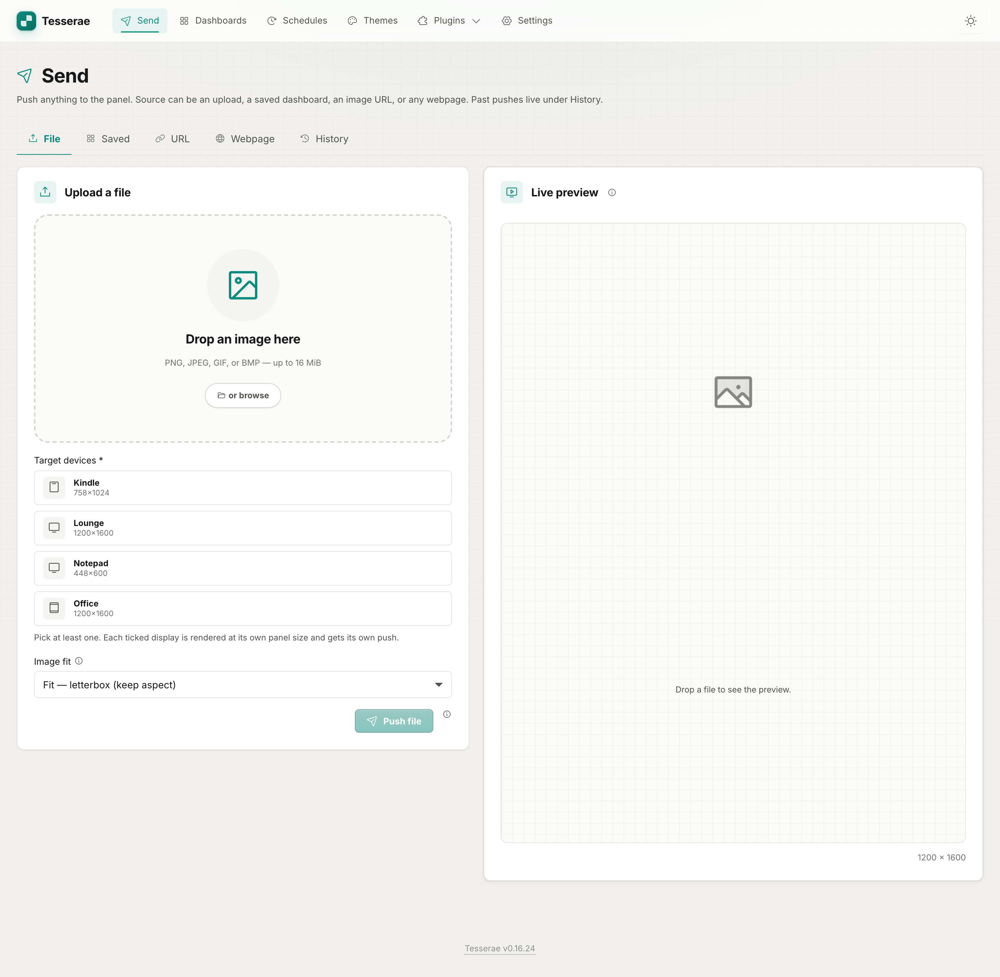
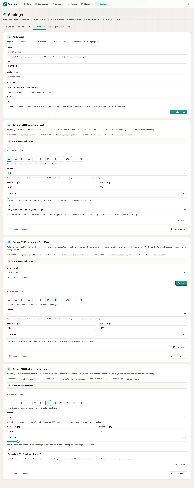
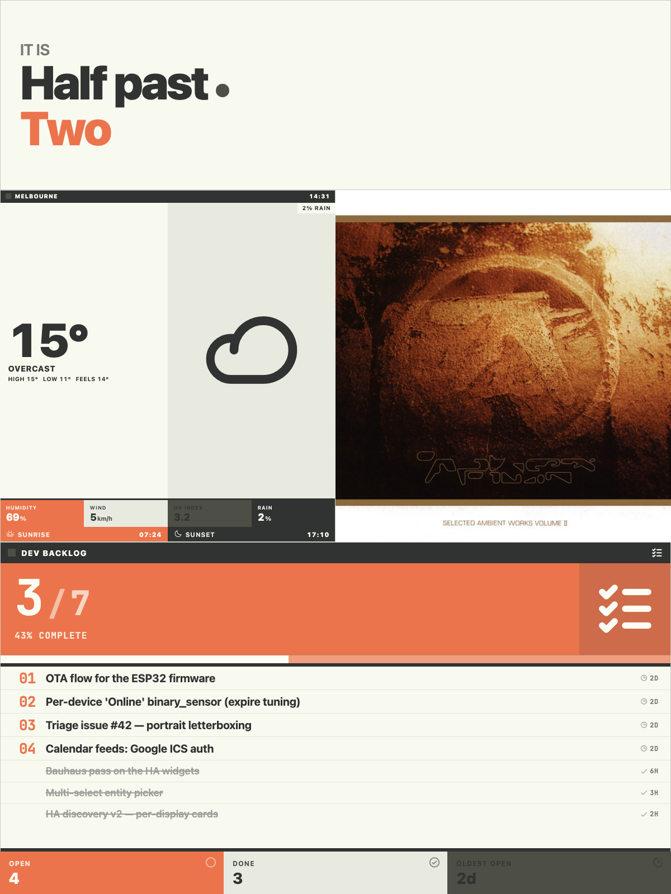
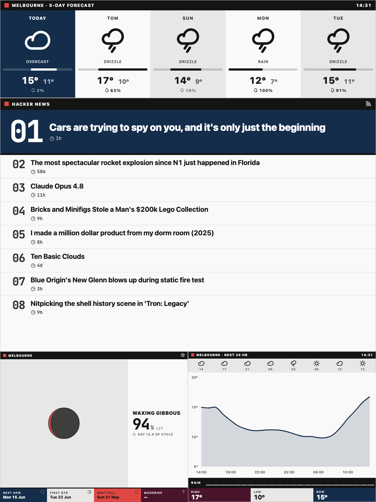
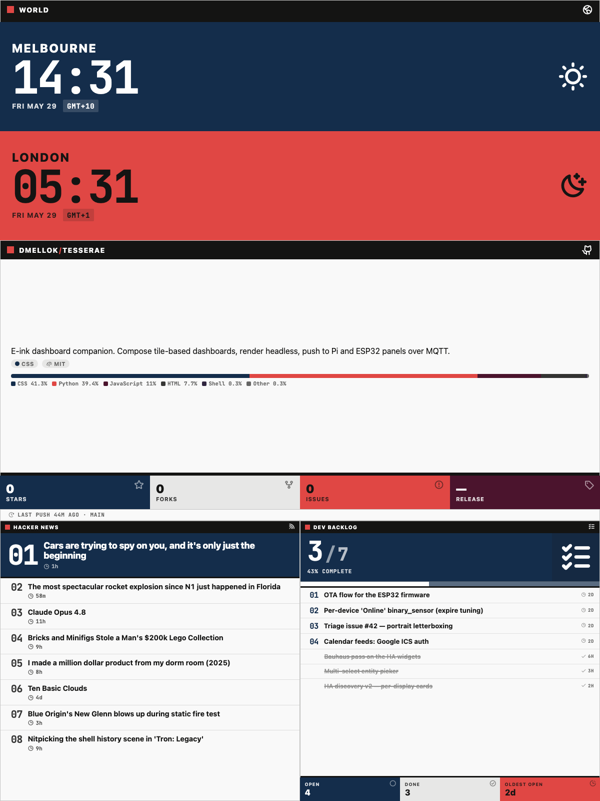
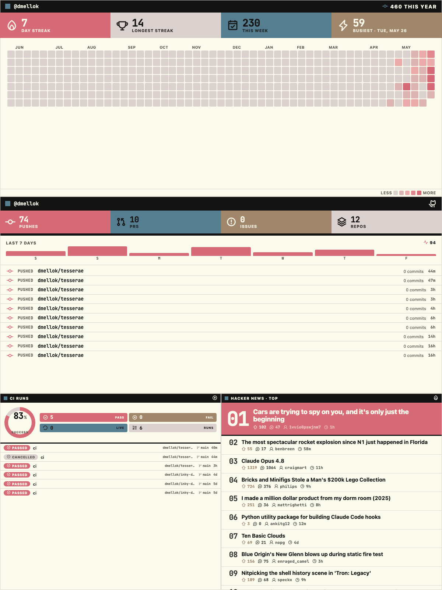

# Tesserae

**Self-hosted e-ink dashboard companion.** Compose tile-based dashboards in
the browser, render them headless, and push the resulting frame to one or more
panels (Raspberry Pi, ESP32) over MQTT.

Sibling rebuild of [inky-dash](https://github.com/dmellok/inky-dash) — same job,
but the publishing pipeline is a first-class extension point: new device, new
renderer, new widget = **drop a folder**. The name comes from
[*tessera*](https://en.wikipedia.org/wiki/Tessera), the individual tile of a
mosaic; the editor composes a dashboard out of cells.

!!! tip "New here? Start with the path that matches you"
    - **I want it running** → [Install Tesserae](install/server.md)
    - **I have a panel to drive** → [Install a client](install/clients.md) then [Set up a device](install/devices.md)
    - **What can it show?** → [Widget gallery](widgets/gallery.md) (47 widgets)
    - **What hardware works?** → [Screens & compatibility](compatibility.md)
    - **I want to build a widget** → [Build a widget with AI](dev/writing-a-plugin.md)

## What it looks like

Compose in the browser — pick widgets, a theme, and which display(s) each
dashboard binds to — then render headless and push the frame over MQTT.

{ loading=lazy }

{ loading=lazy }

{ loading=lazy }

{ loading=lazy }

### Frames pushed to the panels

Each dashboard renders to a panel-sized frame and publishes only to the
display(s) it's bound to — across themes and panel sizes.

{ loading=lazy }

{ loading=lazy }

{ loading=lazy }

{ loading=lazy }

## How it works

1. **Compose** a dashboard of cells in the editor; each cell is a widget plugin.
2. **Render** the dashboard headlessly with Chromium at the target panel's exact pixel size.
3. **Quantise** the frame to the panel's colour palette and pack it for the wire.
4. **Publish** over MQTT; a small client on the panel paints it and sleeps.

The whole publishing tail — renderers, device kinds, and the ~47 widgets — are
drop-a-folder plugins discovered at boot. See
[Build a widget with AI](dev/writing-a-plugin.md) for the authoring path and
[the widget contract](widgets.md) for the full spec.

## Project status

Tesserae is young and built in the open by a solo maintainer. It runs daily on
real hardware (a battery ESP32 + Waveshare 13.3" Spectra 6), but most
panel/client combinations haven't been confirmed yet — see
[what's tested](compatibility.md#whats-been-tested-on-real-hardware). Testers
and contributors are very welcome:
[open an issue or PR](https://github.com/dmellok/tesserae).

For tinkerers, not your mum.
