<!-- AUTO-GENERATED by scripts/gen_widget_gallery.py — do not edit by hand. -->

# Widget gallery

The **47 widgets** that ship with Tesserae. Each is a drop-a-folder plugin under `plugins/<id>/`; drop your own in and it shows up in the editor's picker. Want to build one? See [Build a widget with AI](../dev/writing-a-plugin.md).

!!! note "Stability tiers"
    **Stable** = backed by an official, documented API. **Best-effort** = undocumented but long-lived endpoint. **Fragile** = scraping or a soft policy — convenience only. **Local** = computed on the host, no upstream to break. See [Screens & compatibility](../compatibility.md) for the hardware side.

## Weather

-   **Weather — Air Quality** &middot; `weather_air_quality`

    ---

    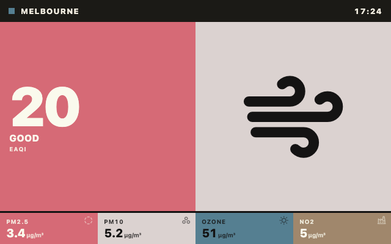

    Air Quality Index (European or US scale) plus PM2.5, PM10, O3, NO2 readings. Data from Open-Meteo CAMS (no API key). Colour-coded panel block reflects the AQI band.

    **Sizes:** `xs` `sm` `md` `lg` &middot; **Tier:** —

-   **Weather — Forecast** &middot; `weather_forecast`

    ---

    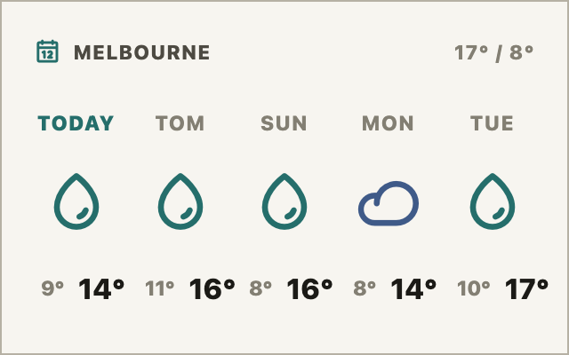

    5-day forecast as a row of theme-aware cards: day name, condition icon, high / low temps, and rain probability. Data from Open-Meteo (no API key).

    **Sizes:** `sm` `md` `lg` &middot; **Tier:** —

-   **Weather — Hourly** &middot; `weather_hourly`

    ---

    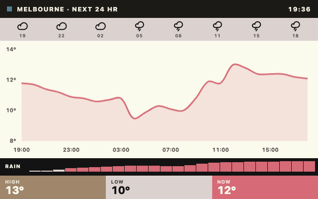

    Next-24-hours temperature curve with a rain-probability strip. Data from Open-Meteo (no API key). Renders via Chart.js for a smooth, theme-coloured curve.

    **Sizes:** `sm` `md` `lg` &middot; **Tier:** —

-   **Weather — Now** &middot; `weather_now`

    ---

    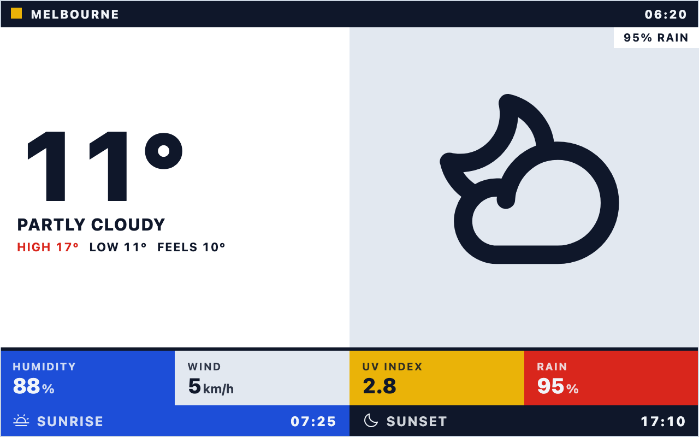

    Current conditions plus feels-like, humidity, wind, UV and sun times. Data from Open-Meteo (no API key required).

    **Sizes:** `xs` `sm` `md` `lg` &middot; **Tier:** —

-   **Weather — Pollen Count** &middot; `weather_pollen_count`

    ---

    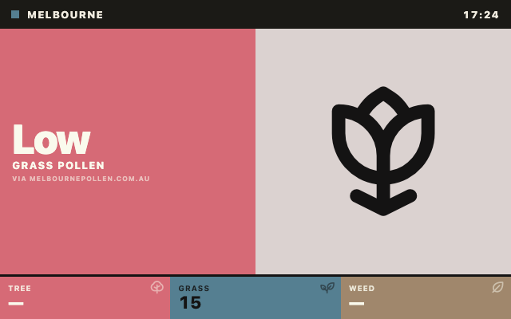

    Daily pollen counts (grass / tree / weed) with a colour-coded severity band. Primary source: Open-Meteo CAMS — Europe-only. Falls back to scraping the Melbourne Pollen Count daily forecast when coordinates are inside Australia.

    **Sizes:** `xs` `sm` `md` `lg` &middot; **Tier:** —

## Clocks & time

-   **Clock — Analog** &middot; `clock_analog`

    ---

    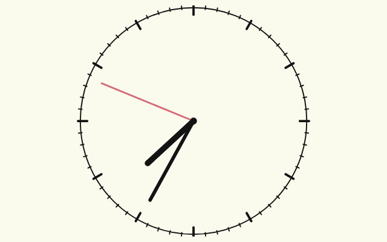

    Analog clock face. Pure SVG, no network. Five face styles — pick the one that suits the rest of your dashboard.

    **Sizes:** `xs` `sm` `md` `lg` &middot; **Tier:** Local

-   **Clock — Word grid** &middot; `clock_qlock`

    ---

    

    QLOCKTWO-inspired letter-grid clock. An 11×10 matrix of letters where the words for the current time light up; everything else stays dim. Pure client-side, no fetch. Rounds to the nearest 5 minutes.

    **Sizes:** `xs` `sm` `md` `lg` &middot; **Tier:** Local

-   **Clock — Sunrise / Sunset** &middot; `clock_sunrise_sunset`

    ---

    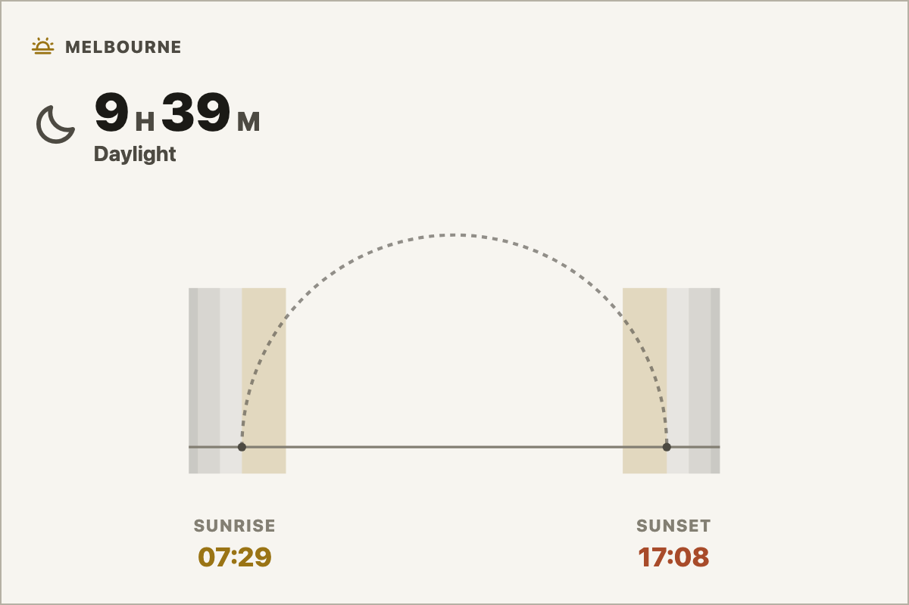

    Today's sunrise, sunset, golden hour, and day length for a chosen lat/lon. The hero shows a sun-arc visualisation with the current position marked. Data from Open-Meteo (no key).

    **Sizes:** `sm` `md` `lg` &middot; **Tier:** —

-   **Clock — Word** &middot; `clock_word`

    ---

    

    Word clock — reads the time as English text, rounded to the nearest five minutes ('Twenty past three'). Pure client-side, ticks every 30 seconds.

    **Sizes:** `xs` `sm` `md` `lg` &middot; **Tier:** Local

-   **Clock — World** &middot; `clock_world`

    ---

    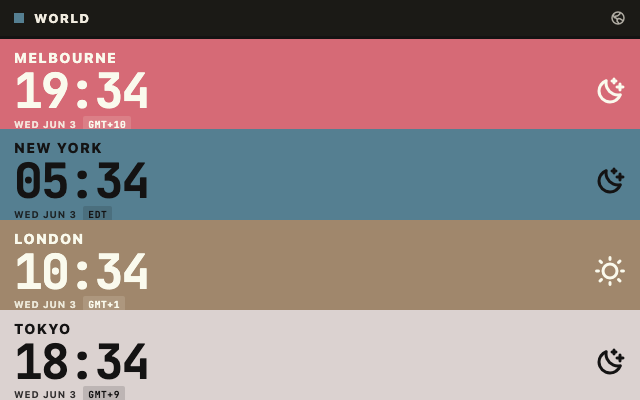

    Multiple cities in one cell, each with its current time in the configured IANA timezone. Pure client-side — uses the browser's Intl.DateTimeFormat with the cell's timezone list.

    **Sizes:** `sm` `md` `lg` &middot; **Tier:** Local

## Calendar

-   **Calendar — Day** &middot; `calendar_day`

    ---

    

    Today's agenda — six Bauhaus / Swiss visual directions to choose from. Reads from feeds configured in Plugins → Calendar Feeds; each feed's colour drives the stripe / marker / fill colour.

    **Sizes:** `xs` `sm` `md` `lg` &middot; **Tier:** —

-   **Calendar — Month** &middot; `calendar_month`

    ---

    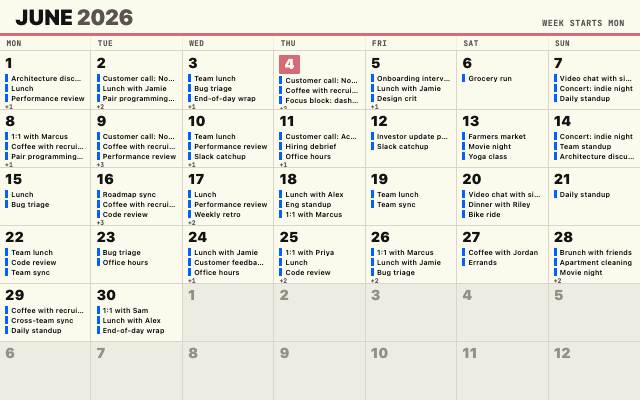

    Month-grid view — six Bauhaus / Swiss visual directions to choose from. Reads from feeds configured in Plugins → Calendar Feeds; each feed's colour drives the bar / dot / stripe colour.

    **Sizes:** `md` `lg` &middot; **Tier:** —

-   **Calendar — Week** &middot; `calendar_week`

    ---

    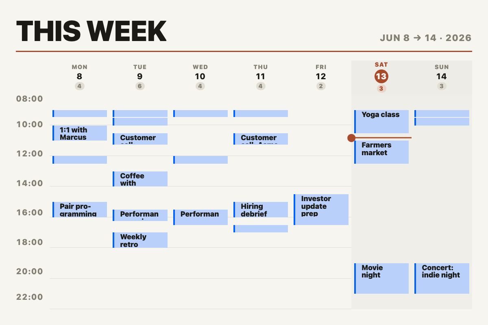

    Seven-day strip — six Bauhaus / Swiss visual directions to choose from. Each event's colour comes from its feed (Plugins → Calendar Feeds).

    **Sizes:** `sm` `md` `lg` &middot; **Tier:** —

## Formula 1

-   **F1 — Last Race** &middot; `f1_last_race`

    ---

    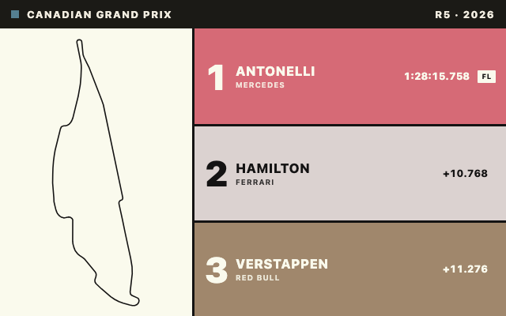

    Podium from the most recently completed F1 race: P1/P2/P3 with driver, team, time/gap, fastest-lap badge, plus the circuit silhouette. Data from Jolpica-F1 (no API key).

    **Sizes:** `xs` `sm` `md` `lg` &middot; **Tier:** —

-   **F1 — Next Race** &middot; `f1_next`

    ---

    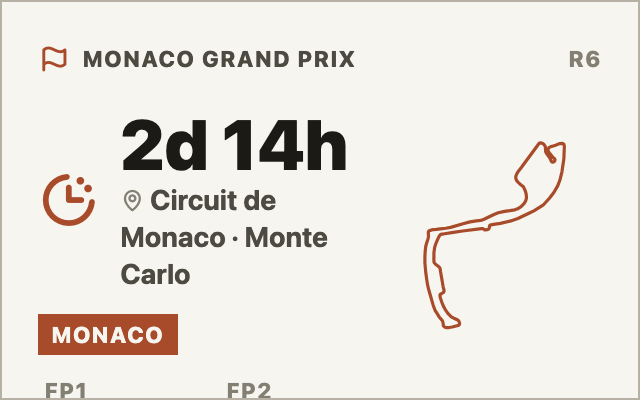

    Countdown to the next F1 race with circuit silhouette, race name, round number, and local session time. Data from Jolpica-F1 (Ergast successor, no API key). Circuits from the bundled f1_core plugin.

    **Sizes:** `xs` `sm` `md` `lg` &middot; **Tier:** —

-   **F1 — Driver Standings** &middot; `f1_standings_drivers`

    ---

    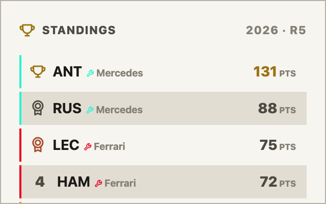

    Current F1 driver championship: position, driver, team, points, wins. Constructor colour stripe on the left of each row. Top 3 shown on xs/sm, top 10 on md, top 20 on lg. Data from Jolpica-F1 (no API key).

    **Sizes:** `xs` `sm` `md` `lg` &middot; **Tier:** —

-   **F1 — Race Weekend** &middot; `f1_weekend`

    ---

    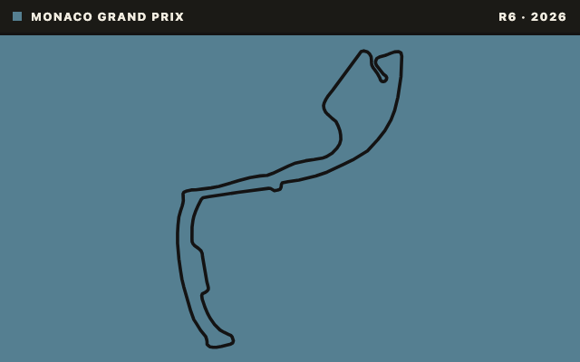

    Session schedule for the upcoming F1 race weekend (FP1, FP2, FP3, Sprint where applicable, Qualifying, Race) with circuit silhouette. Times shown in the viewer's local timezone. Data from Jolpica-F1 (no API key).

    **Sizes:** `sm` `md` `lg` &middot; **Tier:** —

## GitHub

-   **GitHub — Actions** &middot; `github_actions`

    ---

    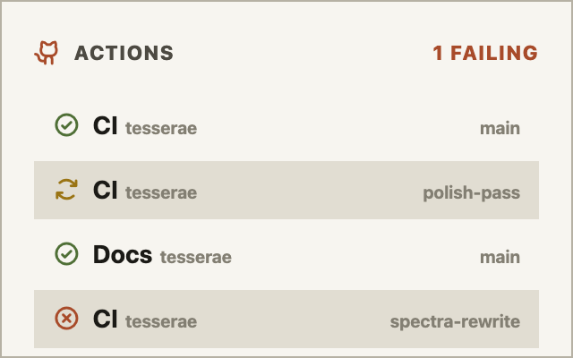

    Most recent CI runs across watched repos with status pills (success / failure / in-progress). Public repos work without a token; private repos require the PAT in Plugins → GitHub Core.

    **Sizes:** `sm` `md` `lg` &middot; **Tier:** —

-   **GitHub — Activity** &middot; `github_activity`

    ---

    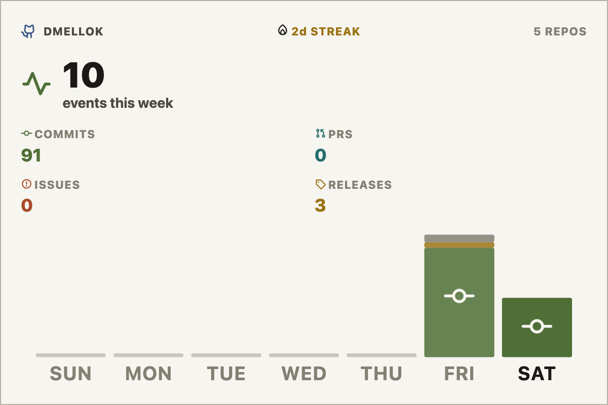

    Recent public activity for a GitHub user — pushes, pull requests, issues, releases. Defaults to the username configured in Plugins → GitHub Core; override per cell.

    **Sizes:** `sm` `md` `lg` &middot; **Tier:** —

-   **GitHub — Contributions** &middot; `github_contributions`

    ---

    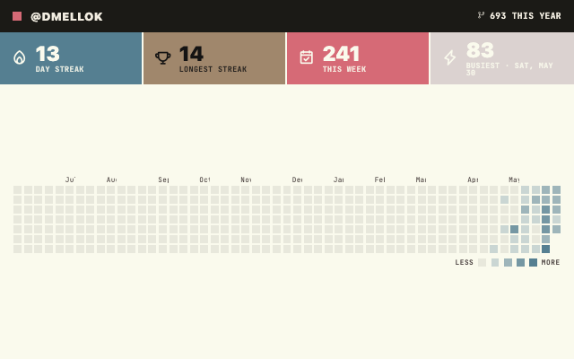

    The familiar 53-week contributions heatmap for a user. Requires a PAT in Plugins → GitHub Core (uses GitHub's GraphQL API which doesn't accept unauthenticated requests).

    **Sizes:** `sm` `md` `lg` &middot; **Tier:** —

-   **GitHub — PR Queue** &middot; `github_pr_queue`

    ---

    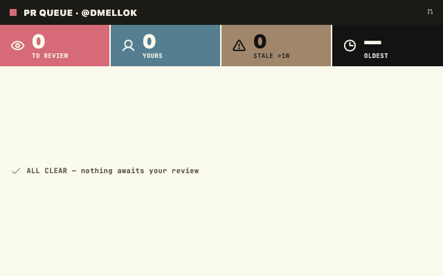

    Your open PRs across orgs + PRs awaiting your review. Requires a PAT in Plugins → GitHub Core (search API needs auth). Two sections: 'Yours' and 'Awaiting review'.

    **Sizes:** `sm` `md` `lg` &middot; **Tier:** —

-   **GitHub — Releases** &middot; `github_releases`

    ---

    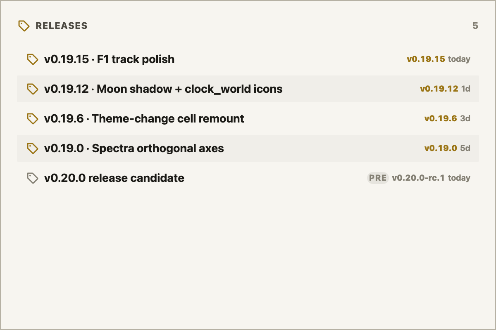

    Latest releases from a list of watched repos. Useful for tracking your dependencies' versions. Public repos work without a token.

    **Sizes:** `sm` `md` `lg` &middot; **Tier:** —

-   **GitHub — Repo Card** &middot; `github_repo`

    ---

    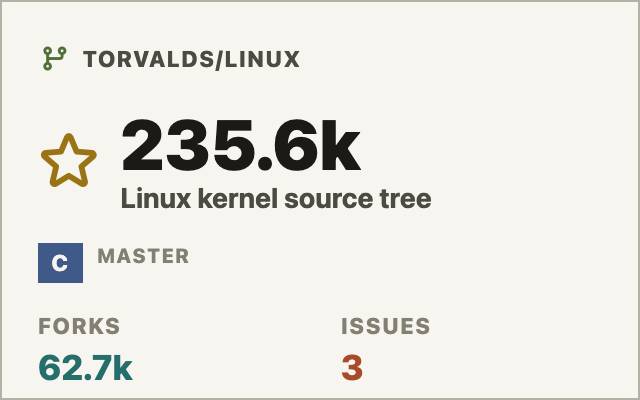

    Single-repo card: stars / forks / open issues / language / last commit / latest release. Public repos work without a token.

    **Sizes:** `xs` `sm` `md` `lg` &middot; **Tier:** —

## News & feeds

-   **News — Hacker News** &middot; `news_hacker_news`

    ---

    

    Top / new / best / show / ask stories from Hacker News. Uses the free Firebase API (no auth, no key). Click-through opens the story; the lightbox doesn't apply.

    **Sizes:** `sm` `md` `lg` &middot; **Tier:** —

-   **News — Reddit** &middot; `news_reddit`

    ---

    

    Top posts from a subreddit using the free .json endpoint (no API key, no OAuth). Pick the subreddit and time window per cell.

    **Sizes:** `sm` `md` `lg` &middot; **Tier:** —

-   **News — RSS / Atom** &middot; `news_rss`

    ---

    

    Latest N headlines from any RSS 2.0 or Atom 1.0 feed. Paste a feed URL; the widget parses both formats with the stdlib XML parser (no extra deps).

    **Sizes:** `sm` `md` `lg` &middot; **Tier:** —

-   **News — Wikipedia On This Day** &middot; `news_wikipedia_otd`

    ---

    

    Wikipedia 'On this day' — featured historical events for today's date. Uses the free Wikimedia REST API (no key).

    **Sizes:** `sm` `md` `lg` &middot; **Tier:** —

## Finance

-   **Finance — Crypto** &middot; `finance_crypto`

    ---

    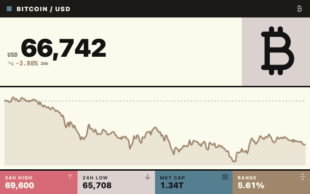

    Single crypto with current price, 24h change, and a 24h sparkline. Data from CoinGecko (free, no API key). Coin ID is the lowercase slug from coingecko.com (e.g. bitcoin, ethereum, solana).

    **Sizes:** `xs` `sm` `md` `lg` &middot; **Tier:** —

-   **Finance — Currency (FX)** &middot; `finance_currency`

    ---

    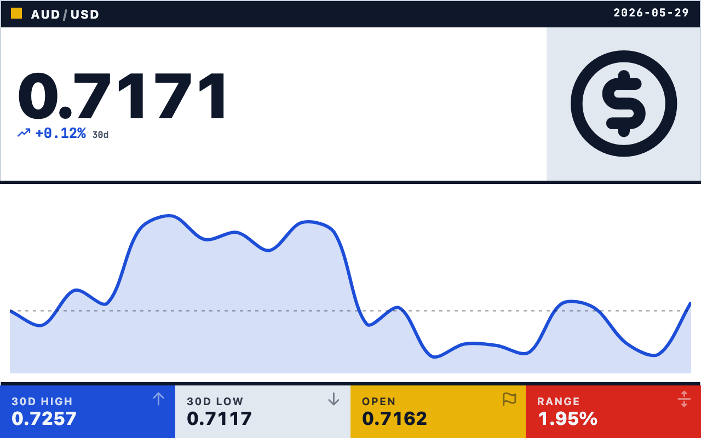

    Single FX pair (e.g. AUD/USD) with current rate + 30-day sparkline. Data from frankfurter.app (free, no key, sourced from European Central Bank). ISO 4217 currency codes.

    **Sizes:** `xs` `sm` `md` `lg` &middot; **Tier:** —

-   **Finance — Stock** &middot; `finance_stock`

    ---

    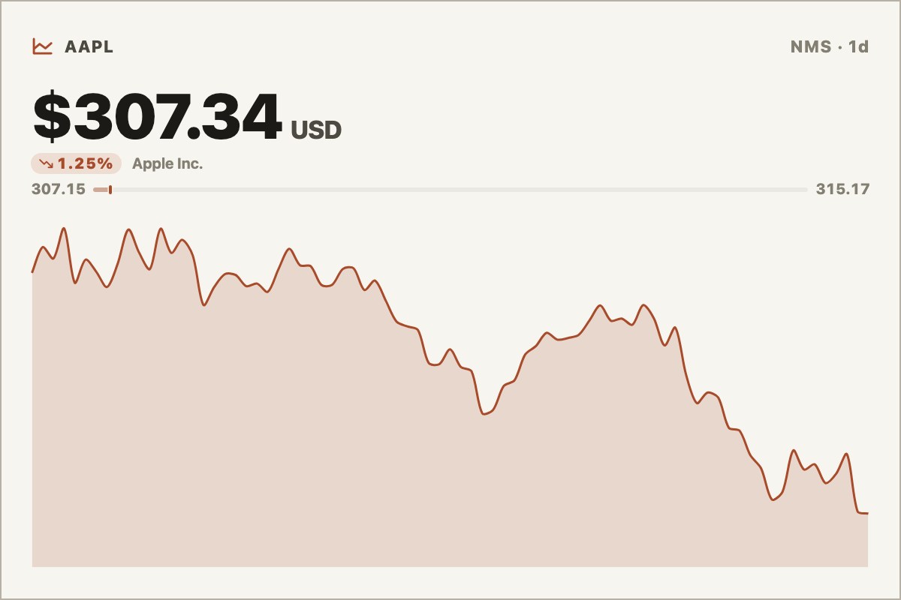

    Single stock ticker with current price + intraday sparkline + day change. Uses Yahoo Finance's public chart endpoint (query1.finance.yahoo.com) — undocumented but stable for years. Symbol format follows Yahoo's: e.g. 'AAPL', 'CBA.AX' (ASX), '^GSPC' (S&P 500 index).

    **Sizes:** `xs` `sm` `md` `lg` &middot; **Tier:** —

## Sky & astronomy

-   **Sky — Air Traffic** &middot; `sky_air_traffic`

    ---

    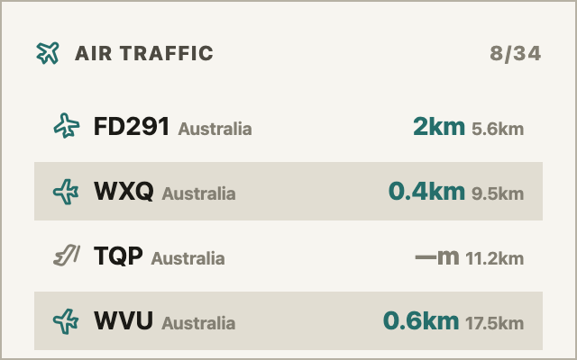

    Flights currently overhead at your location via OpenSky Network (free, no key). Shows count + the nearest N flights with callsign / origin country / altitude / speed.

    **Sizes:** `sm` `md` `lg` &middot; **Tier:** —

-   **Sky — Aurora Forecast** &middot; `sky_aurora`

    ---

    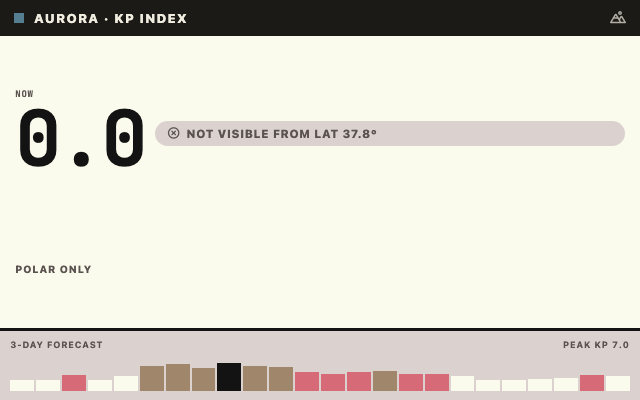

    Current planetary Kp index + 3-day forecast from NOAA SWPC. Higher Kp = aurora visible further from the poles. Includes a viewer-latitude hint so the band reads as 'visible from your location' when conditions allow.

    **Sizes:** `sm` `md` `lg` &middot; **Tier:** —

-   **Weather — BoM Warnings** &middot; `sky_bom_warnings`

    ---

    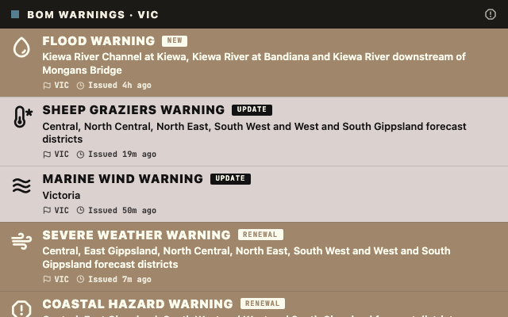

    Current severe weather warnings from the Bureau of Meteorology (Australia). Filter by state — flood, severe thunderstorm, severe weather, bushfire, etc. Uses api.weather.bom.gov.au (the same backend the BoM website itself uses; no key, treat as private/non-redistribution per BoM's terms).

    **Sizes:** `sm` `md` `lg` &middot; **Tier:** —

-   **Sky — Moon Phase** &middot; `sky_moon`

    ---

    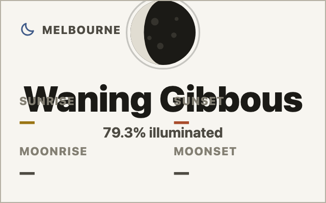

    Current moon phase + illumination, age (days since new moon), upcoming new / first-quarter / full / last-quarter dates, and (optionally) tonight's moonrise + moonset. Phase + age are computed locally from the synodic month; moonrise/moonset comes from Open-Meteo when latitude/longitude are set.

    **Sizes:** `xs` `sm` `md` `lg` &middot; **Tier:** —

## Home Assistant

-   **Home Assistant — Climate** &middot; `ha_climate`

    ---

    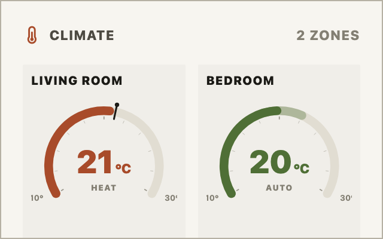

    One or more Home Assistant climate / thermostat entities — six Bauhaus / Swiss visual directions to choose from. Each entity tints by what the thermostat is doing right now (heating / cooling / idle). Requires the Home Assistant Core plugin.

    **Sizes:** `sm` `md` `lg` &middot; **Tier:** —

-   **Home Assistant — Entities** &middot; `ha_entities`

    ---

    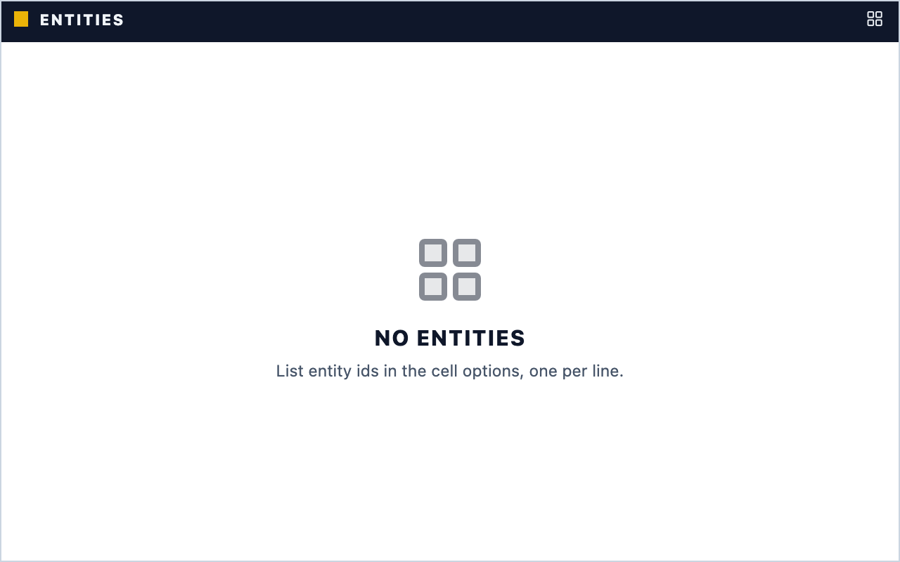

    A status grid of several Home Assistant entities — six Bauhaus / Swiss visual directions to choose from. Each row tints by its state (on / off / other) and shows its current value. Requires the Home Assistant Core plugin.

    **Sizes:** `sm` `md` `lg` &middot; **Tier:** —

-   **Home Assistant — History** &middot; `ha_history`

    ---

    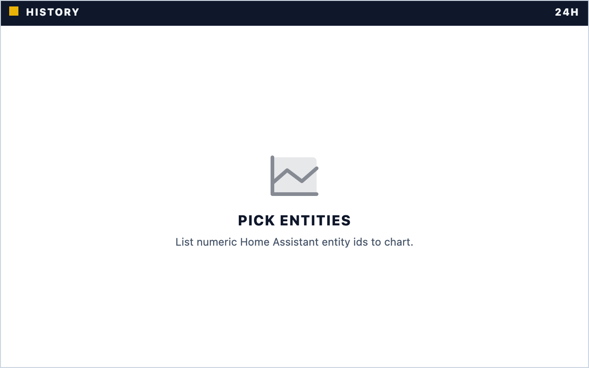

    A numeric Home Assistant sensor over time — six Bauhaus / Swiss visual directions to choose from. Each shows the current value, trend arrow, min/max for the window, and a sparkline of the series. Requires the Home Assistant Core plugin.

    **Sizes:** `sm` `md` `lg` &middot; **Tier:** —

-   **Home Assistant — Sensor** &middot; `ha_sensor`

    ---

    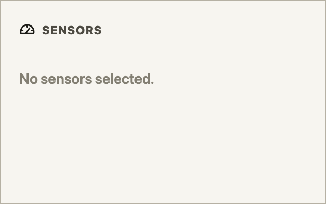

    One or more Home Assistant entities as bold value blocks — six Bauhaus / Swiss visual directions to choose from. A single entity fills the cell as a hero number; several lay out as a 3×2 tile grid. Requires the Home Assistant Core plugin.

    **Sizes:** `xs` `sm` `md` `lg` &middot; **Tier:** —

## Spotify

-   **Spotify — Album Art** &middot; `spotify_album_art`

    ---

    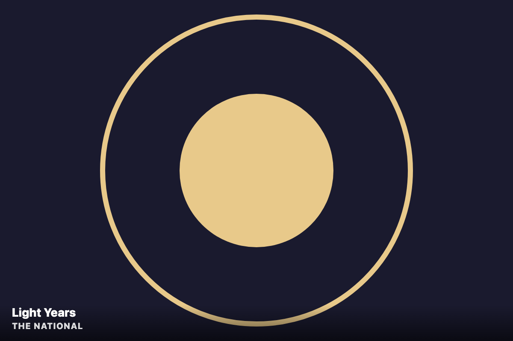

    Full-bleed album art of your currently-playing Spotify track. Requires the Spotify Core plugin (connect your account at Plugins → Spotify).

    **Sizes:** `xs` `sm` `md` `lg` &middot; **Tier:** —

-   **Spotify — Now Playing** &middot; `spotify_now_playing`

    ---

    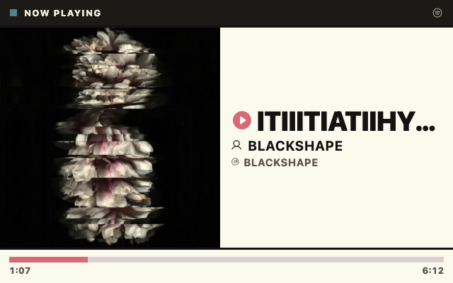

    Currently-playing Spotify track — album art, title, artist, album and progress — in five selectable layouts (split / cover / minimal / vinyl / stack). Requires the Spotify Core plugin (connect your account at Plugins → Spotify).

    **Sizes:** `sm` `md` `lg` &middot; **Tier:** —

## Pictures

-   **Picture — NASA APOD** &middot; `picture_apod`

    ---

    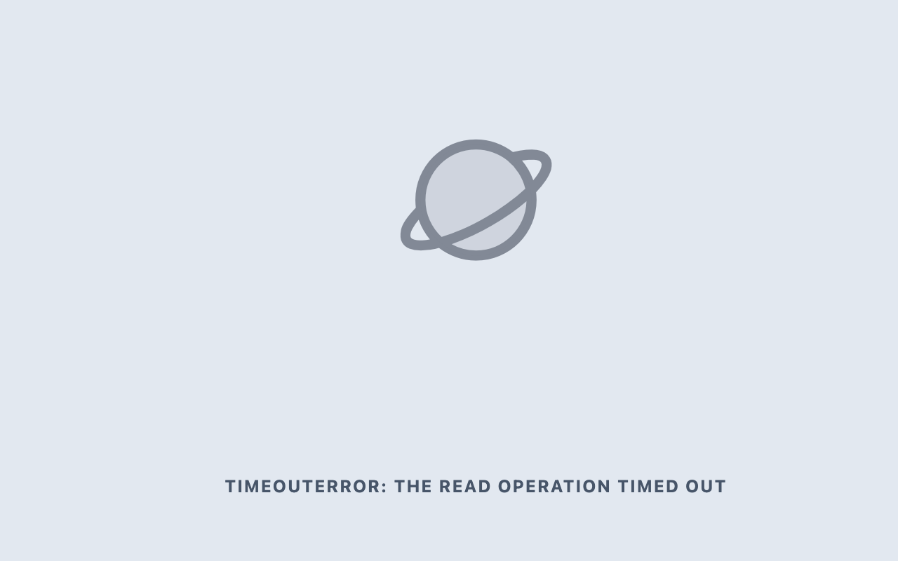

    NASA's Astronomy Picture of the Day, full bleed. Walks back day-by-day past video entries so the cell always shows an image. Uses DEMO_KEY by default; paste your own key at https://api.nasa.gov for a higher rate limit.

    **Sizes:** `sm` `md` `lg` &middot; **Tier:** —

-   **Picture — Apple Shared Album** &middot; `picture_apple_album`

    ---

    

    Rotates through photos in a public iCloud Shared Album, full bleed. Enable Public Website on the album in Photos, then paste its share link (https://www.icloud.com/sharedalbum/#B0xxxxxx) or just the token. NOTE: uses Apple's reverse-engineered shared-album endpoints — undocumented but stable for ~10 years.

    **Sizes:** `sm` `md` `lg` &middot; **Tier:** —

-   **Picture — Gallery** &middot; `picture_gallery`

    ---

    

    Folder-based image rotation, full bleed. Manage folders + uploads at Plugins → Gallery. Supports internal folders (uploaded to the appliance) and external pointers to any directory on the host. Optional orientation filter + random or sequential rotation.

    **Sizes:** `sm` `md` `lg` &middot; **Tier:** Local

-   **Picture — Unsplash** &middot; `picture_unsplash`

    ---

    

    Random photo from Unsplash, full bleed. Filter by search query, collection IDs, or photographer username. Register a free Unsplash developer app at https://unsplash.com/oauth/applications and paste your Access Key in Settings → Plugins → Unsplash.

    **Sizes:** `sm` `md` `lg` &middot; **Tier:** —

## Transit

-   **Public Transport (PTV)** &middot; `public_transport_times`

    ---

    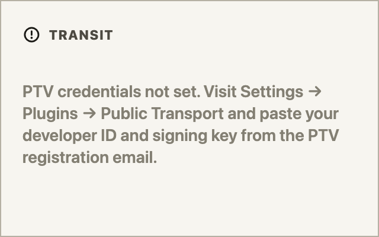

    Next departures from a PTV stop (train / tram / bus / V-Line / night bus). Live data via the PTV Timetable API v3. Register at https://www.ptv.vic.gov.au/footer/data-and-reporting/datasets/ptv-timetable-api/ to receive a developer ID and signing key, then paste them into Settings → Plugins → Public Transport. Pick stop_id + route_type per cell.

    **Sizes:** `xs` `sm` `md` `lg` &middot; **Tier:** —

## Productivity

-   **Todo** &middot; `todo`

    ---

    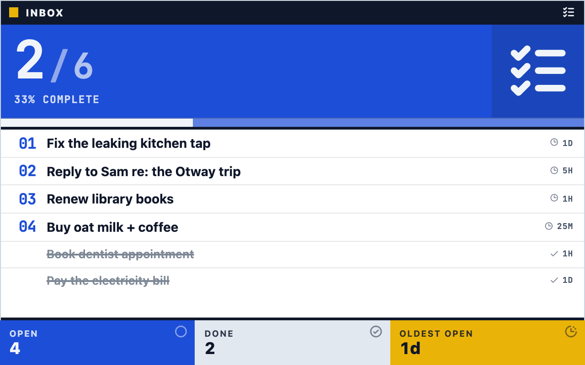

    Persistent todo lists. Create lists and add items on the admin page (Plugins → Todo); the widget cell renders the chosen list as a read-only checklist. Completed items auto-prune after 24 hours so the list doesn't grow indefinitely.

    **Sizes:** `xs` `sm` `md` `lg` &middot; **Tier:** Local

## Web

-   **Webpage** &middot; `webpage`

    ---

    

    Embed an external URL in a cell. The composer captures whatever the iframe renders — handy for status pages, public dashboards, or any site that doesn't deny embedding. Same headless-render path as the Send tab is used when the panel renders. Sites that set X-Frame-Options:DENY or strict CSP cannot be embedded.

    **Sizes:** `sm` `md` `lg` &middot; **Tier:** —

